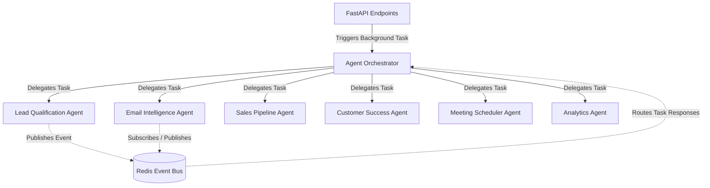

# Project Architecture Skill

Use this skill when you need to understand the high-level architecture of the AI-powered CRM, the folder organization, how agents collaborate, and how the workflows are orchestrated.

## 🏗️ Folder Structure

* `/agents/`: Definitions of autonomous agents that perform CRM actions.
* `/api/`: Modular FastAPI routers containing REST endpoints.
* `/database/`: Database configuration (`connection.py`), PostgreSQL schema (`schema.sql`), and SQLAlchemy ORM models (`models.py`).
* `/workflows/`: The orchestration engine (`orchestrator.py`) that executes workflows and handles event-based routing.

## 🤖 Multi-Agent Collaboration

Agents communicate asynchronously using two methods:
1. **Event Bus (Pub/Sub)**: Facilitated via Redis on the channel `crm:events`.
2. **Event Queue**: Local `asyncio.Queue` per agent for waiting on other agents' output via `collaborate()` and `wait_for_response()`.

## 🔄 Core Workflows

Workflows are coordinated in `workflows/orchestrator.py`:
1. **New Lead Workflow**: Lead Qualification scores & enriches -> If score >= 70, Email Intelligence drafts welcome email -> If score >= 80, Meeting Scheduler schedules introductory call.
2. **Email Processing Workflow**: Email Intelligence analyzes sentiment -> Saves inbound email to DB -> If sentiment is negative, alerts Customer Success.
3. **Deal Health Workflow**: Sales Pipeline Agent checks deal status -> If stalled, Meeting Scheduler drafts follow-up.
4. **Customer Success Workflow**: Customer Success Agent monitors health -> If churn risk is high/critical, alerts success team.
