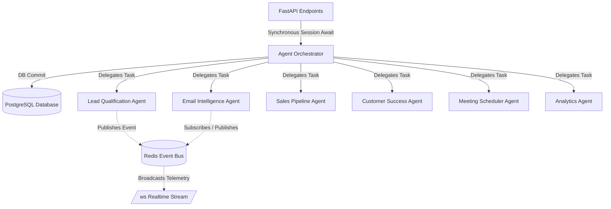

# Project Architecture Skill

Use this skill when you need to understand the high-level architecture of the AI-powered CRM, the folder organization, how agents collaborate, and how the workflows are orchestrated.

## 🏗️ Folder Structure

* `/agents/`: Definitions of autonomous agents extending `BaseAgent` (`base_agent.py`) with `TraceMixin`.
* `/api/`: Modular FastAPI routers containing REST endpoints.
* `/database/`: Database configuration (`connection.py`), PostgreSQL schema (`schema.sql`), and SQLAlchemy ORM models (`models.py`).
* `/frontend/`: Production React 19 + TypeScript SPA with Feature-Sliced Design (`src/features/*`, `src/components/*`, `src/pages/*`, `src/app/*`), Vite, Tailwind CSS, TanStack Query v5, Zustand, Recharts, and Nginx.
* `/workflows/`: Central coordination logic (`orchestrator.py`) managing execution flow, DB sessions, events, and background tasks.

## 🤖 Multi-Agent Collaboration & Database Session Rules

Agents communicate asynchronously and persist telemetry to PostgreSQL:
1. **Synchronous Request Session Awaiting**: FastAPI trigger endpoints (`/api/agents/*`) await orchestrator workflows synchronously with `db: Session = Depends(get_db)` so DB writes (`health_score`, `churn_risk`, `lead_score`, `next_actions`, `prep_materials`, `draft_response`) complete and commit before HTTP response delivery.
2. **Realtime Event Stream (WebSocket & Redis)**: Live telemetry is broadcast via `/ws` and Redis pub/sub.
3. **Visual AI Data Indicators**: Frontend components render glowing **`NEW AI GENERATED`**, **`NEW AI DATA`**, **`NEW AI QUALIFIED`**, and **`NEW AI ANALYZED`** tags on fresh agent executions.
4. **Local Storage Persistence**: AI Generated Reports persist in `localStorage` (`ai_crm_generated_reports`) so generated forecasts survive page reloads.

## 🔄 Core Workflows

Workflows are coordinated in `workflows/orchestrator.py`:
1. **New Lead Workflow**: Lead Qualification scores & enriches -> Updates `Contact.lead_score` & `Contact.lead_status` in DB -> If score >= 70, Email Intelligence drafts welcome email -> If score >= 80, Meeting Scheduler suggests introductory call.
2. **Email Processing Workflow**: Email Intelligence analyzes sentiment -> Saves/updates `Email` record in DB -> If sentiment is negative, alerts Customer Success.
3. **Deal Health Workflow**: Sales Pipeline Agent assesses deal health -> Updates `Deal.health_score`, `Deal.is_stalled`, and `Deal.additional_metadata` -> If stalled, Meeting Scheduler drafts follow-up.
4. **Customer Success Workflow**: Customer Success Agent monitors health (supports bulk `customer_id == "all"`) -> Updates `Customer.health_score`, `Customer.churn_risk`, `Customer.churn_probability`, and `Customer.additional_metadata` in DB -> If churn risk is high/critical, alerts success team.
5. **Meeting Prep Workflow**: Meeting Scheduler generates briefing materials and agendas -> Updates `Meeting.prep_materials` and `Meeting.notes` in DB.
6. **Analytics Forecast Workflow**: Analytics Agent aggregates pipeline metrics and computes executive forecasts -> Frontend stores generated reports dynamically in `localStorage`.
