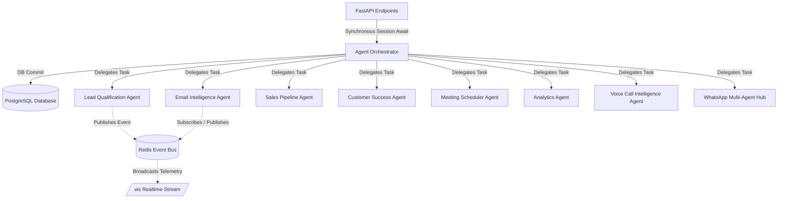

# Project Architecture Skill

Use this skill when you need to understand the high-level architecture of the AI-powered CRM, the folder organization, how agents collaborate, and how the workflows are orchestrated.

## 🏗️ Folder Structure

* `/agents/`: Definitions of autonomous agents extending `BaseAgent` (`base_agent.py`) with `TraceMixin` (Lead Qualification, Email Intelligence, Sales Pipeline, Customer Success, Meeting Scheduler, Analytics, Voice Call, WhatsApp, Custom Agent Builder).
* `/api/`: Modular FastAPI routers containing REST endpoints (`leads.py`, `deals.py`, `customers.py`, `emails.py`, `meetings.py`, `analytics.py`, `voice_calls.py`, `whatsapp.py`, `forecasting.py`, `custom_agents.py`, `i18n.py`, `war_room.py`, `journey.py`, `sequences.py`, `auth.py`, `audit_logs.py`, `tasks.py`, `webhooks.py`, `observability.py`, `tenants.py`, `custom_fields.py`, `import_export.py`).
* `/database/`: Database configuration (`connection.py`), PostgreSQL schema (`schema.sql`), Alembic migrations, and SQLAlchemy ORM models (`models.py`).
* `/services/`: Business services for forecasting (`forecasting_service.py`), translation (`i18n_service.py`), authentication & RBAC (`auth_service.py`), audit trail (`audit_service.py`), task queue (`task_queue_service.py`), and transactional email (`email_service.py`).
* `/frontend/`: Production React 19 + TypeScript SPA with Feature-Sliced Design (`src/features/*`, `src/components/*`, `src/pages/*`, `src/app/*`), Vite, Tailwind CSS, TanStack Query v5, Zustand, Recharts, Nginx, and the Tactical Command design system.
* `/workflows/`: Central coordination logic (`orchestrator.py`) managing execution flow, DB sessions, events, and background tasks.

## 🤖 Multi-Agent Collaboration & System Rules

Agents communicate asynchronously and persist telemetry to PostgreSQL:
1. **Synchronous Request Session Awaiting**: FastAPI trigger endpoints (`/api/agents/*`) await orchestrator workflows synchronously with `db: Session = Depends(get_db)` so DB writes (`health_score`, `churn_risk`, `lead_score`, `next_actions`, `prep_materials`, `draft_response`) complete and commit before HTTP response delivery.
2. **Realtime Event Stream (WebSocket & Redis)**: Live telemetry is broadcast via `/ws` and Redis pub/sub.
3. **Voice AI & Speech Studio**: Real-time turn-by-turn speech analysis, Web Audio spectrum visualizer, live buyer intent tracking, and objection battle-cards (`/api/voice-calls`).
4. **WhatsApp Business Hub**: Autonomous 24/7 AI Auto-Pilot message handling and template broadcast engine (`/api/whatsapp`).
5. **Monte Carlo Revenue Forecasting**: Probabilistic stochastic simulations with P10/P50/P90 confidence bounds, ARR trend progression, and pipeline stage velocity matrix (`/api/forecasting`).
6. **No-Code Custom Agent Builder**: Visual creator for tailored domain agents with custom prompt triggers and toolkits (`/api/custom-agents`).
7. **Dynamic Multi-Language System**: Full RTL/LTR multilingual localization supporting English, Spanish, French, German, Urdu, Arabic, and more (`/api/i18n`).
8. **AI Deal War Room & Strategy Studio**: Multi-agent consensus verdicts, account SWOT matrices, competitor battle-cards, 1-click proposal decks, and autonomous triggers (`/api/war-room`).
9. **Customer Journey & Churn Prevention Studio**: Telemetry-guided lifecycle stage distribution, real-time health score decay monitoring, and 1-click autonomous rescue interventions (`/api/journey`).
10. **AI SDR Multi-Touch Outreach Cadences**: Omnichannel outreach sequencing across Email, WhatsApp, and Voice AI with dynamic step personalization and visual workflow canvas (`/api/sequences`).
11. **Enterprise Security, RBAC & Settings Studio**: Fine-grained role permissions, super admin registration guard, user management CRUD, audit logs, webhooks, and observability metrics (`/api/settings`, `/api/auth`, `/api/audit-logs`).

## 🔄 Core Workflows

1. **New Lead Workflow**: Lead Qualification scores & enriches -> Updates `Contact.lead_score` & `Contact.lead_status` in DB -> If score >= 70, Email Intelligence drafts welcome email -> If score >= 80, Meeting Scheduler suggests introductory call.
2. **Email Processing Workflow**: Email Intelligence analyzes sentiment -> Saves/updates `Email` record in DB -> If sentiment is negative, alerts Customer Success. Outbound transmissions are delegated to `services/email_service.py` via `task_queue.enqueue_email`.
3. **Deal Health Workflow**: Sales Pipeline Agent assesses deal health -> Updates `Deal.health_score`, `Deal.is_stalled`, and `Deal.additional_metadata` -> If stalled, Meeting Scheduler drafts follow-up.
4. **Customer Success Workflow**: Customer Success Agent monitors health (supports bulk `customer_id == "all"`) -> Updates `Customer.health_score`, `Customer.churn_risk`, `Customer.churn_probability`, and `Customer.additional_metadata` in DB -> If churn risk is high/critical, alerts success team.
5. **Customer Journey Intervention Workflow**: Telemetry monitors accounts -> Identifies revenue-at-risk -> Dispatches `CustomerSuccessAgent` rescue playbooks (Executive Sponsor Check-in, Feature Coaching, NPS Sentiment Survey, Renewal Lock-in) -> Boosts health score in DB.
6. **AI SDR Cadence Workflow**: Enrolls targeted prospect cohorts -> Executes multi-touch steps via `EmailIntelligenceAgent`, `WhatsAppAgent`, and `VoiceCallAgent` with custom day delays -> Personalizes copy based on real-time pain points.
7. **Meeting Prep Workflow**: Meeting Scheduler generates briefing materials and agendas -> Updates `Meeting.prep_materials` and `Meeting.notes` in DB.
8. **Voice Call Intelligence Workflow**: Voice AI Agent processes speech turns -> Detects objections & serves rep coaching tips -> Generates post-call executive summary, buyer intent score, and CRM action items.
9. **WhatsApp Conversational Workflow**: Inbound webhook triggers WhatsApp Agent -> Classifies customer intent -> Generates contextual AI Auto-Pilot reply or routes to sales rep.
10. **Revenue Forecasting Workflow**: Monte Carlo simulation runs stochastic iterations over active deals -> Generates P10/P50/P90 confidence boundaries and probability distribution histogram.
11. **AI Deal War Room Workflow**: Joint cross-agent account analysis -> Evaluates SWOT quadrants and competitor displacement kill-shots -> Auto-generates customized proposal contract with tier pricing and SLA terms -> Executes configured multi-agent automation triggers.

