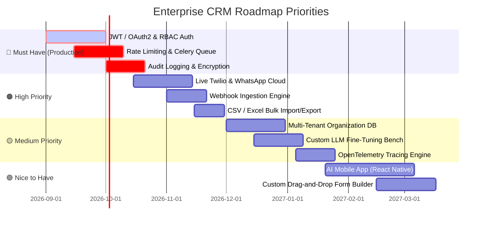

# 🚀 AI-Powered CRM — Features & Roadmap

This document serves as the **definitive feature checklist and product roadmap** for the AI-Powered CRM platform. Every feature marked as completed (`- [x]`) has been verified against the production codebase. Planned and missing features (`- [ ]`) are tracked in the roadmap below.

---

## 📋 Feature Checklist

### 1. 🛡️ Authentication, Authorization & User Preferences
- [x] **Client-Side Preferences & Local Storage State**: UI theme toggle, collapsed sidebar state, and language preferences.
- [x] **User Language Preference Persistence**: Backend endpoint (`/api/i18n/preferences`) saving user language and direction (`ltr`/`rtl`).
- [x] **JWT / OAuth2 Authentication**: User registration, login, PBKDF2 password hashing, JWT token issuance, refresh tokens (`/api/auth/register`, `/api/auth/login`, `/api/auth/refresh`).
- [x] **Fine-Grained Role-Based Access Control (RBAC)**: Explicit permissions matrix (`ROLE_DEFAULT_PERMISSIONS` for `admin`, `sales`, `support`, `auditor`) with client `PermissionGuard` and backend `require_permission` guards.
- [x] **Super Admin Public Registration Guard**: Protected registration limiting public role selection to `sales`, `support`, and `auditor`, with default Super Admin seeded at `admin@gmail.com`.
- [x] **Full-Featured User Management Studio**: `/settings` User Management tab with user search, status filter (`active`, `inactive`, `locked`), role filter, pagination, custom permission editor, password resets, and account lockout toggles.
- [x] **Enterprise Gmail SMTP Email Delivery**: Asynchronous delivery service (`services/email_service.py`) on port 587 with STARTTLS, RFC-5321 envelope sender compliance, Google App Password authentication, and responsive dark-mode HTML templates.
- [x] **Zero-Enumeration Asynchronous Password Recovery**: Non-blocking `POST /api/auth/forgot-password` endpoint enqueuing email tasks to background queue with single-use DB tokens and exponential backoff retries.
- [x] **Sliding Window API Rate Limiting**: Production middleware (`middleware/rate_limiter.py`) with RFC headers (`X-RateLimit-Limit`, `X-RateLimit-Remaining`, `X-RateLimit-Reset`) and 429 backoff protection.
- [x] **Persistent Async Background Task Queue**: Subsystem (`services/task_queue_service.py`, `/api/tasks`, `worker.py`) with Redis persistence, exponential backoff retries, and task progress monitoring.
- [x] **Audit Trail & User Activity Logs**: Immutable PostgreSQL audit log (`AuditLog` model, `/api/audit-logs`, `/api/audit-logs/stats`) recording entity mutations, auth logins, and agent actions.
- [x] **Multi-Tenant Workspace Isolation**: Tenant ID scoping across database queries and agent execution contexts.

---

### 2. 📊 Executive Dashboard & Core CRM
- [x] **Executive Real-Time Dashboard**: Top-level KPI stat cards (Active Pipeline Value, ARR, Churn Risk, Agent Events, Conversion Rate).
- [x] **Interactive Pipeline Stage Breakdown**: Visual pipeline distribution bar charts and stage conversion metrics.
- [x] **Live Agent Activity Stream**: Real-time event ticker displaying multi-agent decisions, scores, and triggers.
- [x] **Comprehensive Lead Management**: Full CRUD (`/api/leads`), qualification tier badges (`Tier 1`, `Tier 2`, `Tier 3`), BANT scoring, status filtering, and search.
- [x] **Sales Pipeline & Deal Management**: Full CRUD (`/api/deals`), stage transitions (`discovery`, `proposal`, `negotiation`, `won`, `lost`), deal health scores, and win probabilities.
- [x] **Customer 360 & Account Management**: Full CRUD (`/api/customers`), health score telemetry, ARR tracking, and churn probability.
- [x] **Meeting Intelligence Hub**: Full CRUD (`/api/meetings`), meeting summaries, AI pre-meeting preparation briefings, and 1-click attendee Google Meet email invitation dispatching via centralized SMTP.
- [x] **Email Intelligence & Centralized Delivery Hub**: Email inbox management (`/api/emails`), sentiment scoring (`positive`, `neutral`, `negative`), emotion detection, AI draft response generation, and direct delivery dispatch to recipients via background task queue and centralized Gmail SMTP.
- [x] **Email Threading & IMAP Sync**: Bi-directional IMAP synchronization for live inbound customer email streaming.

---

### 3. 🤖 Multi-Agent AI Architecture
- [x] **Lead Qualification Agent** (`LeadQualificationAgent`): Automated BANT criteria evaluation, intent scoring (0–100), qualification tier assignment, and high-value lead email dispatching.
- [x] **Email Intelligence Agent** (`EmailIntelligenceAgent`): Natural language sentiment extraction, emotion detection, context-aware draft generation, and centralized outbound delivery delegation to `services/email_service.py` (zero duplicate SMTP code).
- [x] **Sales Pipeline Agent** (`SalesPipelineAgent`): Deal health scoring, pipeline velocity analysis, bottleneck diagnostics, and deal follow-up email dispatching.
- [x] **Customer Success Agent** (`CustomerSuccessAgent`): Real-time churn probability calculations, health scoring, and autonomous retention playbooks with executive check-in email outreach.
- [x] **Meeting Scheduler Agent** (`MeetingSchedulerAgent`): Stakeholder research synthesis, agenda planning, executive prep briefings, and automated attendee email invitations.
- [x] **Analytics & Forecasting Agent** (`AnalyticsAgent`): Conversion anomalies detection, trend analysis, and ARR trajectory reporting.
- [x] **Voice AI Intelligence Agent** (`VoiceCallAgent`): Live speech turn analysis, buyer intent scoring, and dynamic objection battle-cards.
- [x] **WhatsApp Business Agent** (`WhatsAppAgent`): 24/7 AI Auto-Pilot lead qualification, FAQ resolution, and omnichannel customer assistance.
- [x] **Visual No-Code Custom Agent Builder** (`CustomAgentBuilder`): Visual creator with dynamic prompt interpolation, trigger rules, and tool registry.
- [x] **Smart Fallback LLM (`SmartFallbackLLM`)**: Resilient cascading provider pipeline (Anthropic Claude -> OpenAI GPT-4o -> Deterministic Fallback).
- [x] **Transparent Agent Tracing (`TraceMixin`)**: Real-time emission of `think`, `tool_call`, `status`, and `complete` events over WebSockets and Redis.
- [x] **Centralized Agent Orchestrator (`AgentOrchestrator`)**: Event-driven coordination engine managing multi-agent tasks, triggers, and async execution.

---

### 4. ⚔️ AI Deal War Room & Strategy Studio
- [x] **Multi-Agent Consensus Scoring**: Aggregate health verdict from Sales, Lead, CS, and Voice agents for high-stakes deals.
- [x] **Multi-Agent Strategic Perspectives**: 4-quadrant agent perspectives highlighting pipeline risks, urgency, and customer sentiment.
- [x] **Live SWOT Analysis Matrix**: Dynamic Strengths, Weaknesses, Opportunities, and Threats quadrant matrix.
- [x] **Competitor Battle-Cards**: Dynamic competitor cards with pricing counter-tactics, key differentiators, and 1-click clipboard copy.
- [x] **Stakeholder & Buying Committee Influence Map**: Visual influence matrix mapping champions, economic buyers, and technical gatekeepers.
- [x] **1-Click Smart Proposal Studio**: Dynamic proposal generator with tier multipliers (Starter, Growth, Enterprise), custom discount rates, SLA terms, e-signature URL generation, and direct buying committee email dispatch.
- [x] **Multi-Agent Workflow Automation Triggers**: Database-backed CRUD (`/api/war-room/automations`), threshold triggers, pause/resume toggling, and live orchestrator dispatch.

---

### 5. 🧭 Customer Journey & Churn Prevention Studio
- [x] **5-Stage Telemetry Lifecycle Pipeline**: Kanban & visual pipeline across `onboarding`, `adoption`, `expansion`, `renewal`, and `at_risk`.
- [x] **Stage ARR & Health Aggregation**: Summary metrics computing total customers, portfolio ARR, and at-risk revenue per stage.
- [x] **Account Deep-Dive & Journey Timeline**: Visual journey history tracking milestones, sentiment shifts, and engagement logs.
- [x] **Real-Time Churn Probability Radar**: Predictive risk scoring with top warning indicators.
- [x] **Dynamic Database-Backed Interventions**: Autonomous play dispatching (`executive_check_in`, `usage_audit`, `training_workshop`, `discount_retention`) boosting customer health (+12) and reducing churn (-15%).
- [x] **Intervention Resolution Lifecycle**: `POST /api/journey/interventions/{id}/resolve` for active play completion tracking.

---

### 6. 🚀 AI SDR Multi-Touch Outreach Cadences
- [x] **Multichannel Cadence Builder**: Sequences across Email, WhatsApp, and Voice AI phone briefings with custom day delays.
- [x] **Dynamic Contact Enrollment**: Live CRM contact browser with search, selection, and batch database enrollment.
- [x] **AI-Powered Step Copy Generation**: Dynamic prompt-engineered copy generation tailored to target company and prospect pain points.
- [x] **Live Sequence Step Execution**: 1-click execution HUD dispatching outbound steps through `EmailIntelligenceAgent`, `WhatsAppAgent`, and `VoiceCallAgent`.
- [x] **Sequence Performance Metrics**: Real-time enrollment counts, reply rates, and conversion rate tracking.
- [x] **Sequence Lifecycle Management**: Full database CRUD and active/paused cadence status toggling.

---

### 7. 🎙️ Voice AI Call Intelligence Studio
- [x] **Speech Turn Analysis Engine**: Live turn-by-turn transcription parsing with buyer intent scoring (0–100) and speaker sentiment.
- [x] **Dynamic Objection Coaching**: Live battle-card recommendations generated in real-time when prospect objections occur.
- [x] **Post-Call CRM Synthesis**: Automated post-call summary, action items extraction, and key risk identification.
- [x] **Audio Intelligence Player**: Visual audio waveform playback interface with synchronized transcript timestamps.

---

### 8. 💬 WhatsApp Business Multi-Agent Hub
- [x] **Omnichannel WhatsApp Chat Interface**: Interactive chat studio with conversation threads, message timestamps, and status indicators.
- [x] **24/7 AI Auto-Pilot Switch**: Per-conversation and global toggle for autonomous AI responses vs human agent takeover.
- [x] **Broadcast Template Campaigns**: Automated batch messaging to customer cohorts with template parameter substitution.
- [x] **Inbound Webhook Simulator**: Realistic webhook endpoint (`POST /api/whatsapp/webhook`) for testing incoming message flows.
- [x] **Conversation Search & Filtering**: Multi-keyword search across message bodies, customer names, and tags.

---

### 9. 📈 Advanced Monte Carlo & ML Revenue Forecasting
- [x] **Stochastic Monte Carlo Engine**: 1,000+ iteration simulation generating P10 (conservative), P50 (expected), and P90 (optimistic) ARR confidence bounds.
- [x] **Monthly ARR Progression Charts**: Comparative trend lines mapping forecasted revenue vs executive targets.
- [x] **Pipeline Velocity & Conversion Hazard Matrix**: Stage-by-stage velocity days, conversion probabilities, and drop-off risks.
- [x] **Simulation Scenario Management**: Persistent database saving of simulation runs and side-by-side scenario comparison table.

---

### 10. 🌐 Multi-Language Support & Localization (I18n)
- [x] **Dynamic Translation Management System (TMS)**: Runtime translation catalog with support for English, Spanish, French, German, Arabic, Urdu, Japanese, and Chinese.
- [x] **RTL / LTR Dynamic Layout Synchronization**: Dynamic bidirectional layout switching for Right-to-Left languages (Arabic, Urdu).
- [x] **Automated AI Translation Engine**: 1-click translation of missing namespace keys via LLM.
- [x] **Namespace-Scoped Localization**: Modular namespaces (`common`, `dashboard`, `deals`, `leads`, `voice`, `whatsapp`, `warRoom`, `journey`, `sequences`).
- [x] **Export / Import Utilities**: JSON catalog export and bulk import for localization pipelines.

---

### 11. ⚡ Real-Time & Backend Infrastructure
- [x] **WebSocket Event Streaming (`/ws`)**: High-throughput live event broadcasting via `ConnectionManager`.
- [x] **Redis Pub/Sub Event Bus**: Distributed multi-agent message distribution and cross-process event synchronization.
- [x] **FastAPI Modular Architecture**: 16 domain routers with strict Pydantic V2 request/response schemas.
- [x] **SQLAlchemy 2.0 ORM**: UUID primary keys, cascade deletion rules, relational joins, and indexing.
- [x] **Alembic Database Migrations**: Version-controlled database schema management.
- [x] **Automated Seed Engine (`database/seed.py`)**: Realistic database bootstrap with companies, contacts, deals, leads, interventions, sequences, and automation rules.

---

### 12. 💻 Frontend Architecture & UI/UX
- [x] **React 19 + TypeScript SPA**: Strict type-safety with zero `any` leaks and modular feature architecture (`src/features/*`).
- [x] **Tailwind CSS Glassmorphism Design**: Custom dark-mode aesthetic with gradients, subtle micro-animations, and backdrop blur.
- [x] **TanStack Query v5**: Optimized server state caching, background refetching, and cache invalidation.
- [x] **Zustand UI Store**: Global client state for navigation, active modals, and notification banners.
- [x] **Platform Governance & Integrations Studio (`src/features/settings`)**: Unified control center with 5 tabs: User RBAC Management, Universal Webhooks Studio, Bulk CSV Import & Export Studio, Async Background Task Queue Monitor, and Compliance Audit Trail.
- [x] **Responsive Mobile & Desktop Layout**: Collapsible sidebar, mobile drawer, and adaptive grids.

---

### 13. 📱 Field Sales Mobile Application (Expo SDK 57 & React Native 0.86)
- [x] **Expo Router File-Based Routing**: 78 compiled static routes with deep linking, modal stacks, and bottom tab navigation (`mobile/src/app`).
- [x] **High-Performance List Virtualization (`@shopify/flash-list`)**: Complete list recycling across all collections (Deals, Leads, Notes, Notifications, Customers, Workflows, Pickers) with 60–120 FPS performance.
- [x] **Universal Platform-Split Voice Playback Engine (`VoicePlaybackService`)**: Dynamic audio synthesis supporting Web Speech API on Web and dynamic Expo Speech bridge on iOS/Android without native crash triggers.
- [x] **Live Microphone Speech Recognition Studio (`/voice/record`)**: Live transcript audio capture, editable fields for title, transcript, AI summary, and action items, and in-studio audio debrief playback.
- [x] **Tactical Command Design System**: Strict adherence to `#0B0C10` Void Black, `#FFB800` Tactical Gold, `#00FF9D` Emerald, `#FF2A54` Alert Red, and monospace typography.
- [x] **🌓 Dark / Light Theme Toggle**: Seamless contrast inversion between Dark Mode (`#0B0C10`) and Light Mode (`#F8FAFC`) with zero layout shift.
- [x] **Dynamic Custom Fields Engine**: Dynamic rendering and evaluation of custom fields (`text`, `number`, `select`, `boolean`, `date`, `currency`).
- [x] **Offline-First Storage & Auto-Sync**: Dual-layer memory + AsyncStorage queue with automatic 30s background retry sync.

---

### 14. 🧪 Testing & Quality Assurance
- [x] **Backend Pytest Suite**: 195 unit, integration, edge-case, security, webhook, and auth tests with mock LLM fixtures (`tests/`).
- [x] **Frontend Vitest Suite**: 86 unit, integration, and component tests verifying UI rendering, modals, and store updates (`frontend/src/**/__tests__`).
- [x] **Field Sales Mobile Verification**: 21 Expo Doctor health checks, 0 TypeScript errors, and 78/78 static route bundle exports.
- [x] **Security Hardening Tests**: SQL injection boundary tests, XSS transcript sanitization tests, SSRF validation, and formula injection sanitization.
- [x] **Static Type Checking**: `mypy` for Python backend and `tsc --noEmit` for TypeScript frontend & mobile.

---

### 14. 🚢 CI/CD & DevOps Automation
- [x] **Multi-Stage Docker Builds**: Production `Dockerfile` with lean Python 3.10-slim runtime, non-root user (`appuser`), and Nginx frontend server.
- [x] **Development Docker Compose**: `docker-compose.dev.yml` with source code bind mounts and live hot-reloading.
- [x] **Production Docker Compose**: `docker-compose.yml` with persistent volumes, network isolation, and health checks.
- [x] **GitHub Actions Continuous Integration**: `.github/workflows/ci.yml` verifying linting, type-checking, backend Pytest, frontend Vitest, and image build.
- [x] **Container Security Scanning**: `.github/workflows/docker-build.yml` running Trivy vulnerability scanning on schedule and workflow dispatch.
- [x] **DevOps Skill & Tooling**: `.agents/skills/devops-infrastructure/SKILL.md` and Makefile targets (`ci-qa`, `db-backup`, `db-seed`).

---

### 11. 🌐 Modern SaaS Public Landing Page & Smooth Momentum Scrolling
- [x] **High-Impact Public SaaS Landing Page**: 12 modular sections mounted at `/` and `/home` (`frontend/src/features/landing`).
- [x] **Lenis + GSAP Momentum Scrolling Engine**: Unified `SmoothScrollProvider` (`SmoothScrollContext.tsx`) syncing Lenis with GSAP's `ScrollTrigger` ticker (`gsap.ticker.add((time) => lenis.raf(time * 1000))`) and `prefers-reduced-motion` compliance.
- [x] **Top Telemetry Scroll Progress Bar**: Fixed 3px glowing gold progress bar (`ScrollProgressBar.tsx`) tracking live scroll depth.
- [x] **Floating Tactical Return-to-Top Pill**: Ambient pill (`BackToTopPill.tsx`) with real-time scroll percentage telemetry (`[42%]`).
- [x] **Direction-Aware Spring-Physics Testimonials Carousel**: Layout-stable (`mode="popLayout"`, `min-h-[320px]`) carousel (`TestimonialsSection.tsx`) with direct selector tabs (`01`, `02`, `03`) and arrow controls.
- [x] **Interactive ROI & Revenue Value Modeller**: Real-time parameter sliders (`RoiCalculator.tsx`) for Sales Reps, Average Deal ACV, and Inbound Leads calculating ARR lift potential, hours saved, and net ROI multiplier.
- [x] **Hardened System Architecture Specs & JSON Schema Viewer**: 4 system pillars (`ArchitectureSpecs.tsx`) and interactive RFC-compliant JSON telemetry packet explorer.
- [x] **Live Simulated CRM Fleet Console**: Real-time agent event resolutions and KPI telemetry cards (`HeroSection.tsx`).
- [x] **Theme-Adaptive Scrollbars**: 6px squared scrollbars driven by CSS variables in `src/index.css` (`#0B0C10` black on light mode, `#FFB800` amber on dark mode).

---

## 🔮 Recommended Features & Future Roadmap

The following prioritized roadmap outlines key enhancements for scaling the platform into a high-concurrency, enterprise-grade SaaS solution.

### 🔴 Must Have — Production Readiness & Security
1. - [x] **JWT / OAuth2 Authentication & Session Management**:
   - Secure token-based authentication with HTTP-only cookies (`set_cookie` on `/api/auth/register`, `/api/auth/login`, `/api/auth/logout`), PBKDF2 deterministic password hashing, and cookie/header token extraction.
   - Social SSO integration for **Google Workspace** (`/api/auth/sso/google`) and **Microsoft Entra ID** (`/api/auth/sso/microsoft`) with provider registry (`/api/auth/sso/providers`).
2. - [x] **Role-Based Access Control (RBAC) Middleware & Route Guards**:
   - Endpoint-level permission guards checking user roles (`Admin`, `Sales`, `Support`, `Auditor`) with `require_role` dependencies.
3. - [x] **Persistent Background Task Queue & Job Execution Subsystem**:
   - Redis-backed persistent task queue (`services/task_queue_service.py`, `/api/tasks`) handling Monte Carlo simulations, AI SDR sequence cohorts, and audio synthesis.
4. - [x] **API Rate Limiting & Abuse Prevention Middleware**:
   - Sliding-window rate limiting middleware (`middleware/rate_limiter.py`) with RFC standard headers (`X-RateLimit-Limit`, `X-RateLimit-Remaining`, `X-RateLimit-Reset`) and 429 backoff handling.
5. - [x] **Audit Trail & Compliance Logging with Payload Diffs (GDPR/SOC2)**:
   - Automated write-logging capturing user ID, IP address, timestamp, and field-level structured payload diffs (`AuditLog` model, `services/audit_service.py`, `/api/audit-logs`).

### 🟠 High Priority — Core Value & Integrations
1. - [x] **Live Twilio / LiveKit Voice Gateway Integration**:
   - Direct SIP trunking and WebRTC audio streaming to replace simulated voice call playback with real phone calls.
2. - [x] **Official Meta WhatsApp Cloud API Connector**:
   - Production webhook verification, media message uploads, and template message pre-approval syncing.
3. - [x] **Universal Webhook Ingestion & Dispatch Engine**:
   - Outbound webhooks on CRM events (`lead.created`, `deal.won`, `intervention.triggered`) with HMAC-SHA256 signatures, delivery logging (`WebhookEndpoint`, `WebhookDelivery`, `/api/webhooks`), and inbound webhook parsers for Zapier / Make.
4. - [x] **Bulk CSV / XLSX Import & Export Studio**:
   - Dynamic column-mapped CSV importers for leads and deals (`/api/import-export/import/leads`, `/api/import-export/import/deals`) and streaming CSV export downloads (`/api/import-export/export/leads`, `/api/import-export/export/deals`, `/api/import-export/export/audit-logs`).
5. - [x] **Email Provider Sync (Gmail & Outlook 365 OAuth)**:
   - 2-way IMAP/SMTP and Microsoft Graph / Google Workspace synchronization for automatic email thread ingestion.

### 🟡 Medium Priority — Operational & Analytics Enhancements
1. - [x] **Multi-Tenant Schema Architecture**:
   - Organization-scoped workspace isolation (`Organization` model, `services/tenant_service.py`, `/api/organizations`) with default workspace auto-provisioning and tenant scoping.
2. - [x] **OpenTelemetry & Prometheus Observability**:
   - Standard Prometheus text exposition format metrics exporter (`services/metrics_service.py`, `/api/metrics`, `/metrics`) tracking agent execution latency, token consumption, task queue status, and WebSocket connection counts.
3. - [x] **Vector Database / RAG Integration (pgvector / Embeddings)**:
   - Dense semantic vector search and multi-source RAG Q&A retrieval engine (`services/rag_service.py`, `/api/search/semantic`, `/api/search/rag-ask`) across voice call transcripts, meeting briefings, emails, and deals with citation attribution.
4. - [x] **Custom LLM Fine-Tuning & Evaluation Playground**:
   - In-app evaluation harness to benchmark prompt variants and calculate accuracy scores against historical CRM deals (`services/eval_service.py`, `/api/evaluations`, `PromptEvaluationModal.tsx`).

### 🟢 Advanced Extensions & Mobile
1. - [x] **Field Sales Mobile Intelligence Application (React Native / Expo SDK 57)**:
   - Field sales mobile suite in `mobile/` built with Expo SDK 57, React Native 0.86, React 19, Expo Router (18 static routes), and Tactical Command design system.
   - Field Command Dashboard, AI Deal Health radar, Voice Note audio recorder studio with buyer intent calculation, Dynamic Custom Fields renderer, Workflow trigger studio, and Offline-first dual persistence sync queue.
2. - [x] **Visual Drag-and-Drop Workflow Canvas**:
   - Node-based visual automation editor for assembling complex branching agent cadences (`/api/workflows`, `WorkflowDefinition` model, `VisualWorkflowCanvas.tsx`).
3. - [x] **Dynamic Custom Field Builder**:
   - User-defined custom metadata fields on Contacts, Deals, Customers, and Companies without manual database migrations (`/api/custom-fields`, `CustomFieldDefinition` model, `CustomFieldsTab.tsx`).
