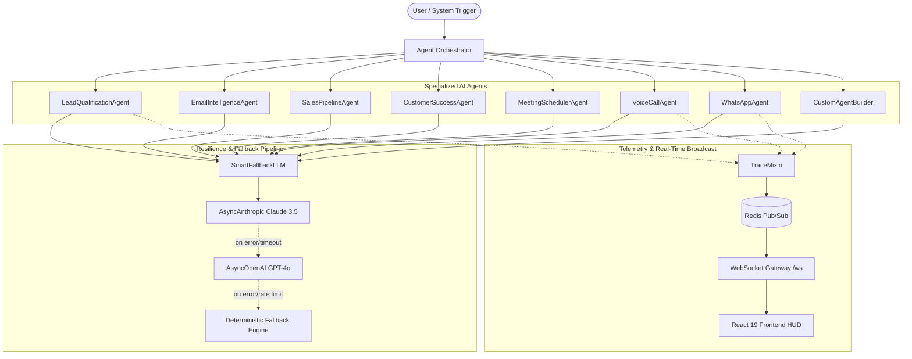

# 🤖 Multi-Agent AI Architecture & Orchestration

The AI-Powered CRM platform leverages a **multi-agent collaborative architecture** where specialized domain agents cooperate to qualify leads, coach sales representatives, prevent customer churn, and automate multichannel outreach.

---

## 🏛️ Agent System Architecture

---

## 🛡️ SmartFallbackLLM Resilience Pipeline

To ensure 99.99% operational uptime and eliminate single points of failure, all agents invoke the LLM through [`agents/smart_llm.py`](../agents/smart_llm.py):

1. **Primary Provider**: Anthropic Claude 3.5 Sonnet (`AsyncAnthropic`)
2. **Secondary Provider**: OpenAI GPT-4o / GPT-4o-mini (`AsyncOpenAI`)
3. **Deterministic Fallback**: In-process rule-based simulation engine guaranteeing continuous local development and unit test pass rates without active API credits.

---

## 🔍 Transparent Telemetry with `TraceMixin`

Every agent class inherits from `TraceMixin` in [`agents/trace_mixin.py`](../agents/trace_mixin.py), automatically publishing execution traces:

- **`think(thought)`**: Emits internal chain-of-thought steps.
- **`tool_call(tool_name, arguments)`**: Emits tool selection and parameter payload.
- **`status(message)`**: Emits intermediate progress updates.
- **`complete(result)`**: Emits final output payload.

Traces are simultaneously broadcasted to Redis Pub/Sub channels and piped over `/ws` to the frontend Live Agent Activity Stream.

---

## 🛠️ Tool Registry & Dynamic Custom Agents

Custom agents created in the No-Code Studio ([`agents/custom_agent_builder.py`](../agents/custom_agent_builder.py)) can dynamically bind to pre-built platform tools:

| Tool Identifier | Description | Target Entity |
|---|---|---|
| `crm_lead_lookup` | Query lead data by email or company | Leads |
| `crm_deal_health` | Calculate current deal pipeline score | Deals |
| `send_whatsapp_message` | Dispatch outbound WhatsApp template | WhatsApp |
| `schedule_calendar_invite`| Create calendar event for stakeholders | Meetings |
| `churn_risk_analyzer` | Run telemetry risk model on account | Customers |
