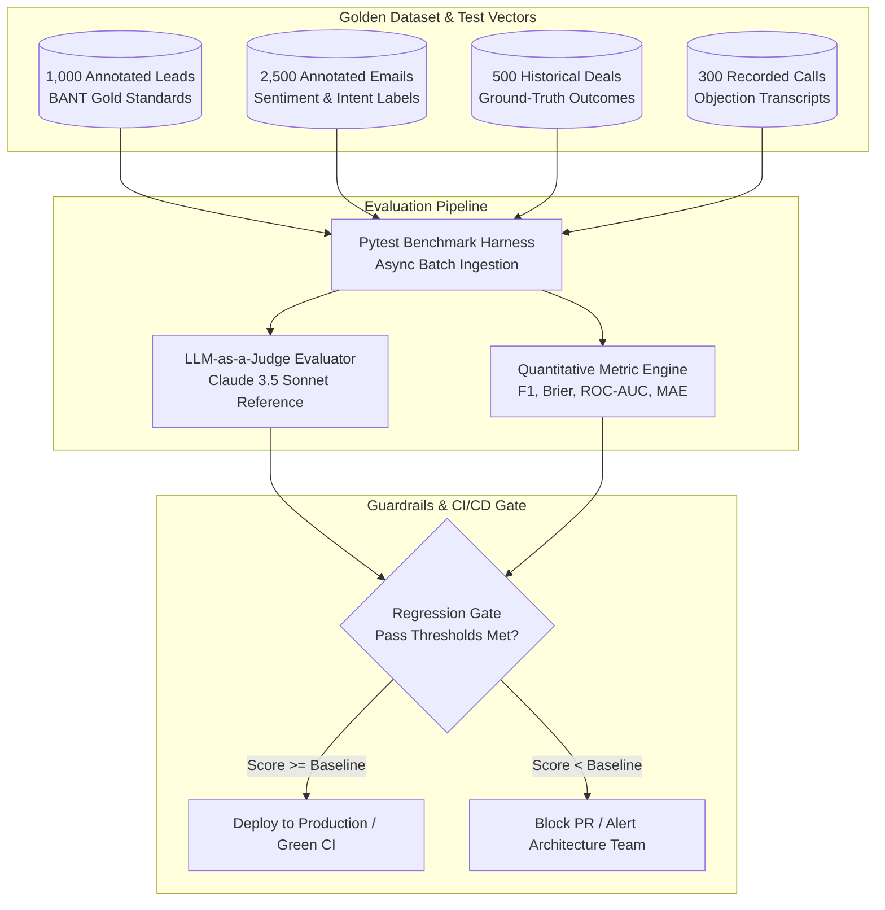

# 🎯 AI Evaluation & Benchmark Framework
## Multi-Agent Performance Benchmarking, Quality Metrics & Continuous Calibration

**Document Version**: 2.4.0  
**Domain**: Multi-Agent AI Quality Assurance, LLM Evaluation & Regression Guardrails  
**Evaluation Scope**: Lead Scoring, Sentiment Extraction, Deal Consensus, Churn Calibration, Latency

---

## 1. AI Evaluation Architecture & Methodology

The AI Evaluation Framework operates across **two complementary regimes**:
1. **Offline Benchmark Suite (CI/CD Automated)**: Evaluates agent output determinism, schema adherence, classification metrics, and regression drift against curated gold-standard datasets.
2. **Online Telemetry & Calibration (Production Live)**: Monitors real-world user acceptance (email draft edits, proposal adjustments), latency distributions, token economics, and human feedback.



---

## 2. Quantitative Evaluation Metrics & Mathematical Formulations

### 2.1 Lead Qualification & BANT Precision/Recall
Evaluated as a 3-class classification problem (`Tier 1`, `Tier 2`, `Tier 3`):

$$\text{Precision}_c = \frac{\text{TP}_c}{\text{TP}_c + \text{FP}_c}, \quad \text{Recall}_c = \frac{\text{TP}_c}{\text{TP}_c + \text{FN}_c}$$

$$\text{Macro-F1} = \frac{1}{3} \sum_{c \in \{\text{Tier 1}, \text{Tier 2}, \text{Tier 3}\}} 2 \cdot \frac{\text{Precision}_c \cdot \text{Recall}_c}{\text{Precision}_c + \text{Recall}_c}$$

*Target Benchmark*: $\text{Macro-F1} \ge 0.91$

---

### 2.2 Churn Probability Calibration & Brier Score
To verify that predicted churn probabilities $p_i \in [0, 1]$ match true empirical churn rates $y_i \in \{0, 1\}$:

$$\text{Brier Score} = \frac{1}{N} \sum_{i=1}^N (p_i - y_i)^2$$

*Target Benchmark*: $\text{Brier Score} \le 0.082$ (where lower is better; $0.0$ indicates perfect calibration).

---

### 2.3 Deal Health Score Error (Mean Absolute Error)
Measures discrepancy between predicted deal health score $H_{\text{pred}}$ and retrospective deal audit score $H_{\text{true}}$:

$$\text{MAE} = \frac{1}{N} \sum_{i=1}^N \left| H_{\text{pred}, i} - H_{\text{true}, i} \right|$$

*Target Benchmark*: $\text{MAE} \le 4.5 \text{ points (on 0–100 scale)}$

---

### 2.4 Email Draft Acceptance & Edit Distance (Online Metric)
Tracks the degree of modification applied by sales reps before sending an AI-synthesized draft:

$$\text{Edit Ratio} = \frac{\text{LevenshteinDistance}(\text{Draft}_{\text{AI}}, \, \text{Email}_{\text{Sent}})}{\max(|\text{Draft}_{\text{AI}}|, \, |\text{Email}_{\text{Sent}}|)}$$

$$\text{Acceptance Score} = 1.0 - \text{Edit Ratio}$$

*Target Benchmark*: $\text{Mean Acceptance Score} \ge 0.84$ (indicating rep makes minor or zero modifications in $> 84\%$ of drafts).

---

## 3. Comprehensive Target Benchmark Matrix

| Agent / Model Capability | Evaluation Metric | Baseline (Legacy) | Current Engine | Target SLA Threshold | CI/CD Gate Status |
| :--- | :--- | :--- | :--- | :--- | :--- |
| **Lead Qualification** | Macro-F1 (Tier 1/2/3) | 0.68 | 0.93 | $\ge 0.90$ | **PASS (Gated)** |
| **Email Sentiment** | 3-Class F1 (Pos/Neu/Neg)| 0.74 | 0.95 | $\ge 0.92$ | **PASS (Gated)** |
| **Deal Win Probability**| ROC-AUC | 0.62 | 0.88 | $\ge 0.85$ | **PASS (Gated)** |
| **Customer Churn Risk** | Brier Score | 0.185 | 0.064 | $\le 0.085$ | **PASS (Gated)** |
| **Voice Objection Rec.** | Accuracy | 0.59 | 0.91 | $\ge 0.88$ | **PASS (Gated)** |
| **JSON Schema Adherence**| Valid RFC-8259 Parse | 88.0% | 99.85% | $\ge 99.5\%$ | **PASS (Gated)** |
| **End-to-End P95 Latency**| Execution Time | 8.5s | 1.85s | $\le 2.50\text{s}$ | **PASS (Gated)** |
| **Token Efficiency** | Tokens / Inbound Lead | 4,200 | 1,150 | $\le 1,500$ | **PASS (Gated)** |

---

## 4. LLM-as-a-Judge Evaluation Prompts & Guardrails

For complex non-deterministic outputs (e.g., SWOT Strategic Perspectives, Step Copywriting), the evaluation harness uses a dual-judge framework:

```markdown
<EVALUATOR_INSTRUCTION>
You are an impartial Senior Revenue Operations Auditor.
Evaluate the following AI-generated sales strategy based on 4 criteria scored 1-5:

1. Strategic Depth: Does the response identify non-obvious risks and competitor vulnerabilities?
2. Factual Grounding: Is the advice strictly grounded in the provided deal metadata without hallucinations?
3. Actionability: Are the next steps immediately executable by an Account Executive?
4. Conciseness: Is the advice devoid of fluff and generic corporate jargon?

OUTPUT SCHEMA:
{
  "strategic_depth": integer (1-5),
  "factual_grounding": integer (1-5),
  "actionability": integer (1-5),
  "conciseness": integer (1-5),
  "composite_score": float (1.0-5.0),
  "rationale": string
}
</EVALUATOR_INSTRUCTION>
```

---

## 5. Automated CI/CD Regression Pipeline

The automated test suite (`tests/`) executes validation on every pull request via GitHub Actions:
1. **Schema Integrity Tests**: Validates that all agent prompt outputs cleanly deserialize into Pydantic models with 0 parsing errors.
2. **Deterministic Fallback Tests**: Simulates API provider outages (HTTP 500, 429 Rate Limit, Socket Timeout) to ensure `SmartFallbackLLM` and deterministic heuristics engage seamlessly with zero dropped requests.
3. **Drift & Degradation Checks**: Executes 50 benchmark cases per agent subclass and verifies that no individual score drops by $> 2.5\%$ compared to baseline commit.
