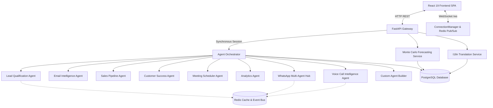

# 🏛️ Enterprise Multi-Agent CRM Architecture Overview

This document provides a technical overview of the AI-Powered CRM system, detailing its multi-agent orchestration, realtime telemetry pipeline, database persistence model, and modular frontend feature architecture.

---

## 📐 High-Level Architecture

---

## 🤖 Multi-Agent Fleet Specification

| Agent | Module | Primary Capabilities |
|---|---|---|
| **Lead Qualification** | `agents/lead_qualification_agent.py` | Automated scoring (0–100), ICP evaluation, public data enrichment |
| **Email Intelligence** | `agents/email_intelligence_agent.py` | Sentiment classification, tone analysis, smart reply generation |
| **Sales Pipeline** | `agents/sales_pipeline_agent.py` | Deal health scoring, close probability, stalled deal detection |
| **Customer Success** | `agents/customer_success_agent.py` | Customer health index, churn probability, proactive retention alerts |
| **Meeting Scheduler** | `agents/meeting_scheduler_agent.py` | Context-aware calendar scheduling, prep materials & briefing notes |
| **Analytics** | `agents/analytics_agent.py` | Executive KPI aggregation, pipeline summaries, anomaly detection |
| **Voice AI Intelligence** | `agents/voice_call_agent.py` | Real-time speech turn analysis, objection battle-cards, intent scoring |
| **WhatsApp Hub** | `agents/whatsapp_agent.py` | 24/7 AI Auto-Pilot conversation handler, broadcast campaigns |
| **Custom Agent Builder** | `agents/custom_agent_builder.py` | No-code dynamic agent instantiation with custom prompts and tools |

---

## 🔄 Real-Time Telemetry & Event Bus

1. **WebSocket Stream (`/ws`)**:
   - `ConnectionManager` maintains active client connections.
   - Broadcasts real-time events (`agent_activity`, `voice_call_update`, `whatsapp_message`, `pipeline_update`).
2. **Redis Pub/Sub**:
   - Inter-agent asynchronous message passing.
   - Scalable event broadcasting across multi-worker server deployments.

---

## 🗄️ Database Architecture

The persistence layer uses PostgreSQL with SQLAlchemy 2.0 ORM:
* **Core CRM**: `Contact`, `Company`, `Deal`, `Customer`, `Email`, `Meeting`, `ActivityLog`.
* **Voice AI**: `VoiceCall`, `VoiceCallTranscript`.
* **WhatsApp**: `WhatsAppConversation`, `WhatsAppMessage`.
* **Forecasting**: `ForecastSimulation`.
* **Custom Agents**: `CustomAgentModel`.
* **Multi-Language**: `Language`, `TranslationKey`, `Translation`.
* **Customer Journey**: `CustomerIntervention`.
* **AI SDR Cadences**: `OutreachSequence`, `SequenceEnrollment`.

---

## 🎨 Frontend Feature Architecture

The frontend uses **Feature-Sliced Design** in `frontend/src/features/`:
1. `dashboard/` — Executive KPI summary & live agent feed.
2. `leads/` — Qualification table & enrichment triggers.
3. `deals/` — Drag-and-drop Kanban pipeline & health scores.
4. `customers/` — Churn monitoring & health index gauges.
5. `emails/` — Smart inbox with sentiment badges & AI drafts.
6. `meetings/` — AI calendar & meeting prep agendas.
7. `analytics/` — Comprehensive reports & pipeline metrics.
8. `agents/` — Fleet control center & terminal logs.
9. `voice-ai/` — Call intelligence studio, simulator & transcripts.
10. `whatsapp/` — Omnichannel chat hub, auto-pilot & broadcasts.
11. `forecasting/` — Monte Carlo simulations, ARR trends & scenarios.
12. `custom-agents/` — Visual no-code agent builder & playground.
13. `multi-language/` — Translation manager & RTL/LTR synchronization.
14. `war-room/` — AI Deal War Room, strategy studio, proposal builder, and workflow triggers.
15. `journey/` — Customer journey progression, ARR tracking, and retention playbooks.
16. `sequences/` — AI SDR multi-touch outreach cadences & live execution HUD.
