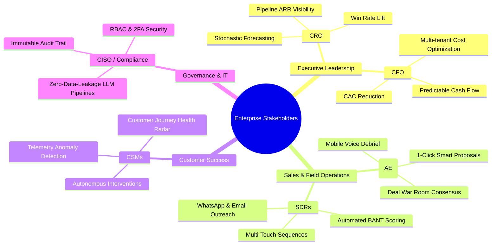
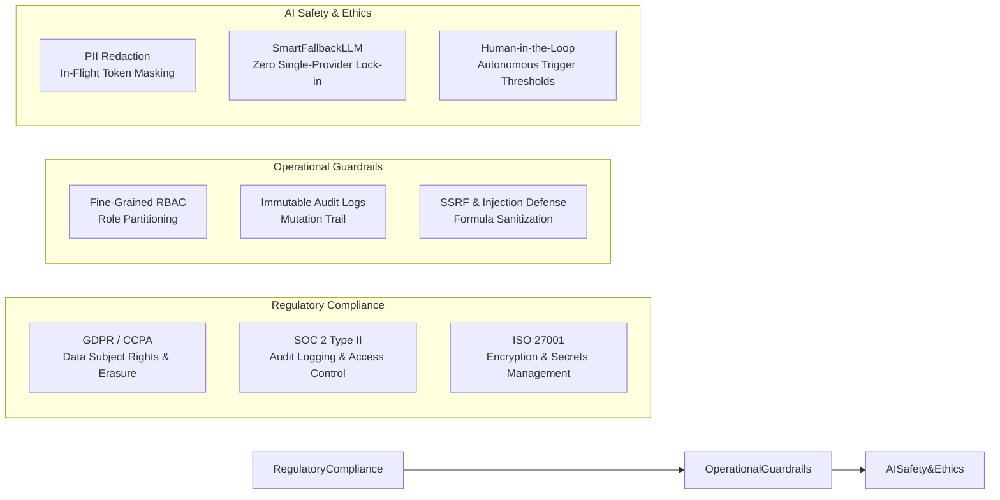

# 💼 Business Requirement Document (BRD)
## Multi-Agent Autonomous Enterprise CRM Business Case & ROI Framework

**Document Version**: 2.4.0  
**Business Domain**: Enterprise Revenue Operations (RevOps), Sales Acceleration & Customer Success  
**Executive Sponsor**: Chief Revenue Officer (CRO) & VP of Technology

---

## 1. Business Context & Strategic Drivers

### 1.1 Market Dynamics
Enterprise B2B organizations are confronted with escalating Customer Acquisition Costs (CAC), protracted sales cycles (often exceeding 90–180 days), and high post-sale customer churn rates. Existing legacy CRM systems act as static databases of record rather than proactive intelligence engines. Sales representatives spend fewer than 36% of their time actively selling, with the remainder consumed by manual CRM updates, prospect research, email drafting, meeting scheduling, and post-call notes collation.

### 1.2 Strategic Objectives
The AI-Powered CRM system transforms the revenue organization into an **autonomous RevOps engine** by achieving three strategic goals:
1. **Accelerate Pipeline Velocity**: Compress sales cycles by 35% through instantaneous inbound lead scoring, automated multi-touch SDR cadences, and dynamic objection coaching.
2. **Maximize Net Revenue Retention (NRR)**: Elevate NRR from 92% to > 115% by proactively identifying churn telemetry risks and deploying automated retention plays.
3. **Optimize Operational Efficiency**: Save 15+ hours per representative per week through automated multi-agent CRM synthesis, proposal generation, and multi-channel triage.

---

## 2. Stakeholder Ecosystem & User Profiles

---

## 3. Financial Impact & Comprehensive ROI Model

### 3.1 Quantified Business Value Metrics

| Value Dimension | Legacy Baseline | Target AI-CRM State | Business Impact |
| :--- | :--- | :--- | :--- |
| **Inbound Lead Triage Time** | 4.5 hours average | < 15 seconds | **99.9% faster** lead engagement |
| **Deal Close Rate** | 21.0% | 33.5% | **+59.5% relative lift** in deal win rate |
| **Annual Churn Rate** | 13.8% ARR | 4.2% ARR | **69.5% reduction** in lost gross ARR |
| **Weekly Admin Hours / Rep** | 18.5 hrs/rep/week | 3.0 hrs/rep/week | **15.5 hours/rep/week** freed for selling |
| **Sales Cycle Duration** | 78 days | 51 days | **34.6% reduction** in deal cycle latency |

### 3.2 ROI Mathematical Formulation

The Net ROI for an enterprise deployment of $N$ sales representatives with average deal ACV of $A$, closed deals per year $D$, and representative annual loaded cost $C_{\text{rep}}$ is calculated as:

$$\Delta \text{Revenue} = N \times D \times A \times \left( \frac{\text{WinRate}_{\text{AI}} - \text{WinRate}_{\text{Base}}}{\text{WinRate}_{\text{Base}}} \right)$$

$$\text{Labor Savings} = N \times \left( \frac{\Delta \text{Hours}_{\text{saved}}}{40} \right) \times C_{\text{rep}}$$

$$\text{Net ROI Multiplier} = \frac{\Delta \text{Revenue} + \text{Labor Savings} - \text{Cost}_{\text{Platform}}}{\text{Cost}_{\text{Platform}}}$$

*Example: For a mid-market enterprise with 50 reps, $50,000 ACV, and $150,000 platform investment, the projected 12-month net ROI is **4.8x–6.2x**.*

---

## 4. Business Functional Requirements

### 4.1 Revenue Acceleration & Deal War Room
* **BR-101: Multi-Agent Consensus**: The system must synthesize inputs from Sales, Lead, Customer Success, and Voice AI agents to produce a unified deal win probability score for all enterprise opportunities exceeding $50,000.
* **BR-102: Instant Proposal Generation**: Enable Account Executives to produce customized, tier-calculated proposals with dynamic discount guardrails and e-signature links in under 60 seconds.
* **BR-103: Dynamic Objection Battle-Cards**: Provide real-time competitive counter-arguments during active negotiation and voice debriefs.

### 4.2 Customer Churn Defense & Expansion
* **BR-201: Real-Time Churn Telemetry**: Continuously monitor usage velocity, customer sentiment, and support tickets to calculate churn risk on a 0–100 scale.
* **BR-202: Autonomous Retention Playbooks**: Automatically execute pre-approved retention workflows (`executive_check_in`, `usage_audit`, `training_workshop`, `discount_retention`) when churn probability exceeds 65%.

### 4.3 Multi-Channel Engagement
* **BR-301: Omnichannel SDR Cadences**: Support coordinated multi-touch prospecting sequences across Email, WhatsApp Business, and Voice AI phone briefs.
* **BR-302: 24/7 AI WhatsApp Auto-Pilot**: Enable round-the-clock conversational triage for global customers with seamless human agent handoff triggers.

### 4.4 Field Sales Mobile Enablement
* **BR-401: Offline Field Command**: Provide field sales representatives with complete mobile access to CRM records, notes, and dynamic custom fields with automatic sync upon network reconnection.
* **BR-402: Voice Debrief Studio**: Allow field representatives to record verbal post-meeting notes, auto-extract action items, and synthesize CRM record updates via speech AI.

---

## 5. Regulatory Compliance, Governance & Risk Management

### 5.1 Risk Mitigation Matrix

| Risk Category | Potential Impact | Probability | Mitigation Strategy |
| :--- | :--- | :--- | :--- |
| **LLM Provider Outage** | Interruption of agent scoring and auto-drafting | Medium | `SmartFallbackLLM` automatic cascading from Anthropic to OpenAI to deterministic rules. |
| **Email Reputation Degradation** | Delivery failures or spam blacklisting | Low | Rate-limited background task queues, RFC-5321 envelope validation, and STARTTLS encryption. |
| **Data Leakage Across Tenants** | Cross-tenant data exposure | Low | Strict tenant ID scoping across all SQLAlchemy database queries and WebSocket channels. |
| **Formula Injection via CSV** | Client spreadsheet execution vulnerabilities | Medium | Automated prefixing (`'`) of calculation trigger characters in all CSV export utilities. |
| **Unauthorized Role Escalation** | Unauthorized access to administrative settings | Very Low | Server-side `require_permission` enforcement and protected Super Admin seeded accounts. |
