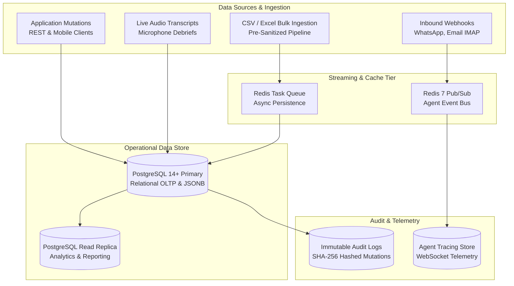
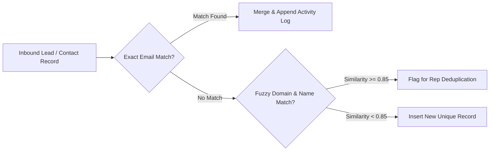

# 🗄️ Data Strategy & Governance Document
## Enterprise Data Architecture, Lifecycle Management & Governance

**Document Version**: 2.4.0  
**Scope**: Enterprise CRM Data Pipeline, Storage Topology, Governance & Compliance  
**Author**: Data Architecture & Security Working Group

---

## 1. Enterprise Data Architecture & Topology



---

## 2. Master Data Management (MDM) & Entity Resolution

### 2.1 Contact & Account Deduplication Pipeline
To prevent pipeline fragmentation and duplicate prospect records, inbound records pass through an automated entity resolution pipeline:



#### String Similarity Distance Metric
For company name resolution, the system computes the Levenshtein-Damereau edit ratio:
$$\text{Sim}(s_1, s_2) = 1 - \frac{\text{LevDist}(s_1, s_2)}{\max(|s_1|, |s_2|)}$$

---

## 3. Multi-Tenant Data Isolation Strategy

1. **Logical Tenant Partitioning**:
   - Every database model inherits a mandatory foreign key `tenant_id: UUID (Indexed)`.
   - Every database query executed via SQLAlchemy is filtered by default within the tenant boundary:
     ```python
     query = db.query(Deal).filter(Deal.tenant_id == current_user.tenant_id)
     ```
2. **WebSocket & Pub/Sub Isolation**:
   - Channel namespaces are segregated by tenant (`crm:tenant:<tenant_id>:events`).
   - Cross-tenant event broadcasting is blocked at the `ConnectionManager` gateway layer.

---

## 4. Data Lifecycle, Retention & Archival Policies

| Data Classification | Storage Medium | Retention Policy | Purge / Archival Procedure |
| :--- | :--- | :--- | :--- |
| **Active CRM Entities** (Deals, Leads, Contacts) | PostgreSQL Primary | Indefinite (while account active) | Soft-delete with `is_deleted` flag; permanent purge on tenant deletion |
| **Audit Logs & Compliance Records** | PostgreSQL Audit Table | 7 Years (SOC2 compliance) | Automated cold storage archiving to immutable WORM storage |
| **Ephemeral OTP & 2FA Tokens** | `OtpToken` Table | 2 Minutes active; 24 Hours in DB | Scheduled daily purge cron job |
| **Agent Trace Events & Telemetry** | Redis & Log Streams | 30 Days rolling window | Automated Redis TTL eviction (`EXPIRE 2592000`) |
| **Voice Audio & Transcripts** | PostgreSQL Text / Blob | 3 Years | Audio blob compression; text transcripts retained for model evaluation |

---

## 5. Privacy, Compliance & Data Subject Rights (GDPR / CCPA)

```mermaid
flowchart TD
    Request[GDPR Data Subject Request] --> Type{Request Type}
    Type -->|Right of Access (Art. 15)| Export[JSON Data Export Package\nAll Contacts, Emails, Logs]
    Type -->|Right to Rectification (Art. 16)| Mutate[Single Entity Mutation & Audit Trail]
    Type -->|Right to Erasure (Art. 17)| Purge[Cryptographic Erasure\nCascading Hard-Delete & Anonymization]
    Export --> NotifyUser[Secure Download URL Dispatched via Email]
    Purge --> LogCompliance[Log Compliance Certificate in Immutable Audit]
```

### 5.1 Right to Erasure (GDPR Art. 17) Implementation
When an erasure request is executed for a contact:
1. Hard-delete all direct communications (Emails, WhatsApp messages, Voice debriefs).
2. Anonymize all financial historical records (Deals, Closed ARR) by substituting identifiable names with `Anonymized Contact [Hash]`.
3. Flush all cached entries in Redis (`crm:contact:<id>`).
4. Generate a signed cryptographic receipt in the audit trail.

---

## 6. High Availability, Backup & Disaster Recovery SLAs

| Metric | Target SLA | Implementation Mechanism |
| :--- | :--- | :--- |
| **Recovery Point Objective (RPO)** | $\le 5\text{ minutes}$ | Continuous PostgreSQL Write-Ahead Log (WAL) archiving to off-site object storage |
| **Recovery Time Objective (RTO)** | $\le 15\text{ minutes}$ | Automated container failover and database replica promotion |
| **Daily Full Snapshots** | 02:00 UTC Daily | Automated snapshot with AES-256 encryption and multi-region replication |
| **Point-in-Time Recovery (PITR)** | 30-Day Window | WAL-based replay capability across any timestamp in the past 30 days |
| **Database Encryption** | AES-256 | Transparent Data Encryption (TDE) at rest; TLS 1.3 in-transit |
