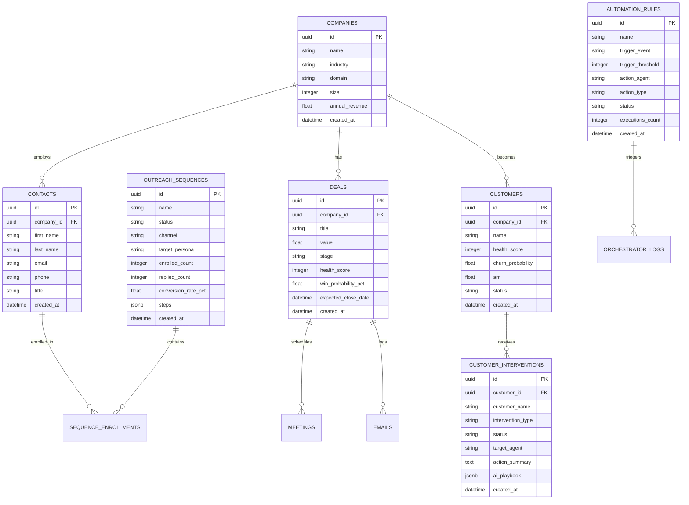

# 🗄️ Database Architecture & Migrations

This guide outlines the database schema, relational models, indexing strategies, and migration workflows for the AI-Powered CRM platform.

---

## 🏗️ Technology Stack

- **RDBMS**: PostgreSQL 14+ (production) / SQLite support (test/local fallback)
- **ORM**: SQLAlchemy 2.0 (Declarative Base with UUID primary keys)
- **Migrations**: Alembic
- **Session Management**: Scoped session lifecycle via FastAPI `Depends(get_db)`

---

## 📐 Entity Relationship Model



---

## 🔑 Key Database Conventions

1. **UUID Primary Keys**: All entity IDs are generated using `uuid.uuid4()` strings, preventing ID enumeration attacks.
2. **Cascading Deletes**: Child tables (`CustomerIntervention`, `SequenceEnrollment`) configure `cascade="all, delete-orphan"` to guarantee referential integrity.
3. **Optimized Indexes**: Indexed columns on high-frequency lookup fields (`email`, `stage`, `status`, `customer_id`, `sequence_id`).
4. **JSONB Flex Columns**: Complex agent copy steps and AI playbooks are stored in flexible JSONB structures while maintaining typed Python models.

---

## 🔄 Migrations Workflow with Alembic

### 1. Apply Pending Migrations
```bash
# Run latest database migrations
alembic upgrade head
```

### 2. Generate a New Migration
```bash
# Auto-generate migration from SQLAlchemy models
alembic revision --autogenerate -m "Add custom field column to deals"
```

### 3. Rollback Migration
```bash
# Rollback previous revision
alembic downgrade -1
```

---

## 🌱 Automated Database Seeding

The platform includes an automated seed pipeline in [`database/seed.py`](../database/seed.py):

```bash
# Seed initial demo dataset
python3 database/seed.py
```

This bootstraps:
- 5 Companies & 10 Contacts
- 6 Deals across different stages (`discovery`, `proposal`, `negotiation`, `won`)
- 5 Customer accounts with health scores and ARR
- 3 Active Churn Interventions
- 3 Omnichannel SDR Cadence Sequences
- 3 Multi-Agent Automation Rules
