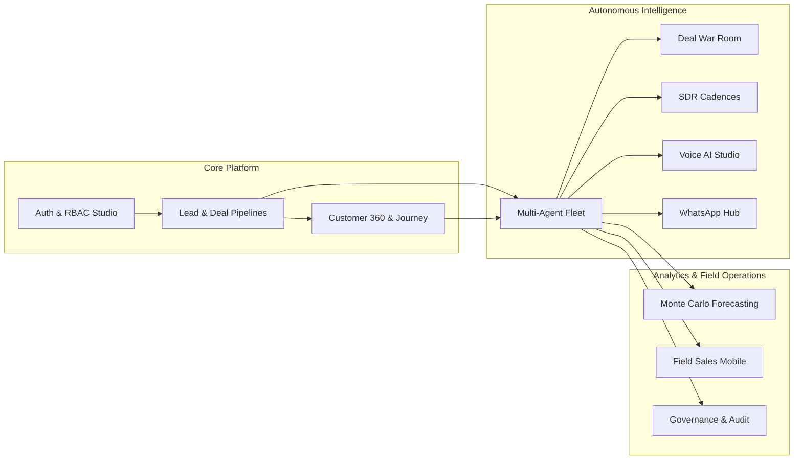
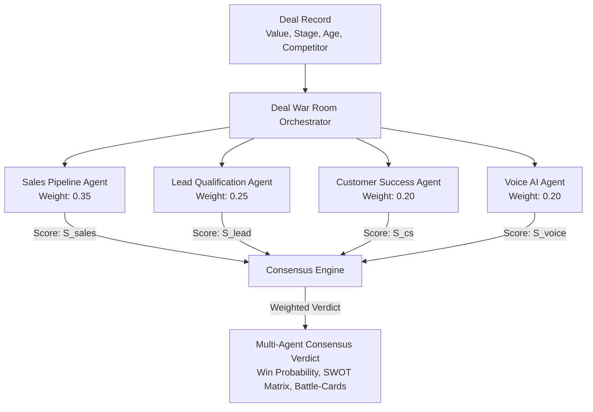
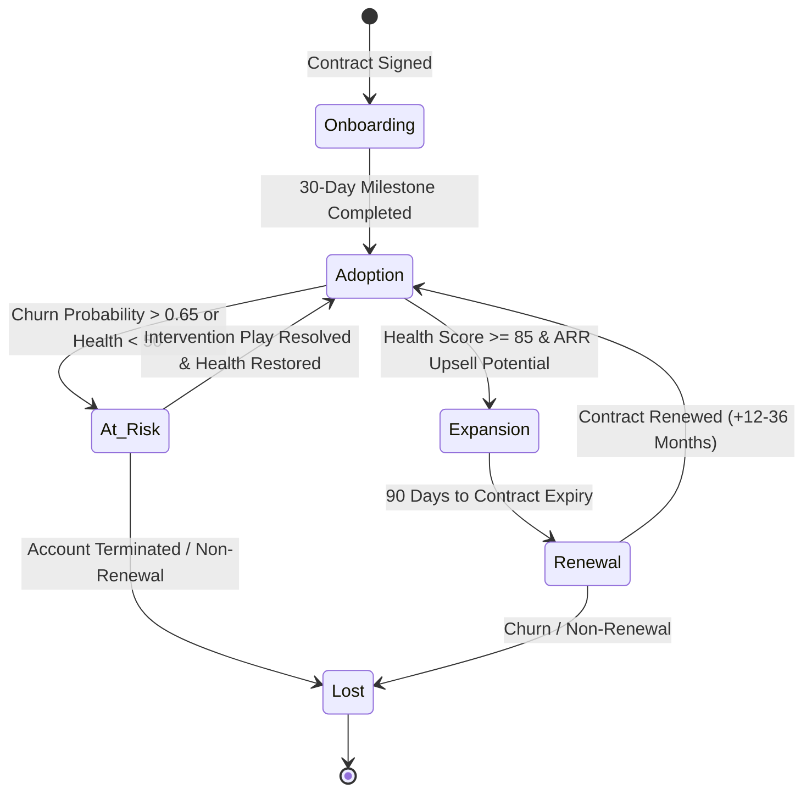
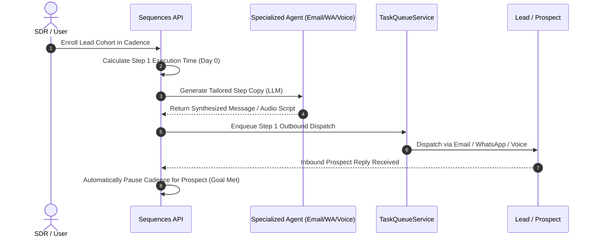
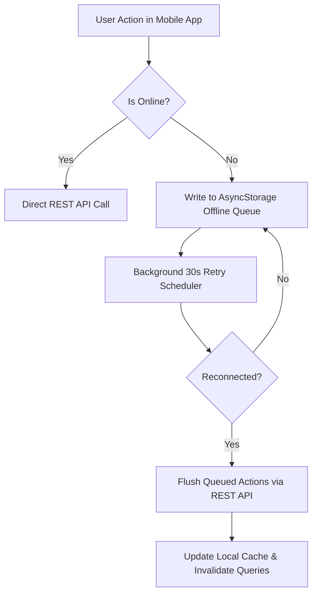

# 📄 Functional Requirement Document (FRD)
## Multi-Agent Autonomous Enterprise CRM Functional Specifications & Business Logic

**Document Version**: 2.4.0  
**Target Domain**: Functional Workflows, State Machines & Business Logic Algorithms  
**System Scope**: Web Application, Mobile Field Sales, Multi-Agent Fleet, Background Queues

---

## 1. Functional Modules Overview

---

## 2. Detailed Functional Specifications & Business Logic

### 2.1 Lead Qualification & BANT Engine (`LeadQualificationAgent`)

#### Functional Flow
1. Inbound lead record is ingested via REST API (`POST /api/leads`) or CSV import.
2. `LeadQualificationAgent` parses BANT parameters:
   - **Budget ($B$)**: Quantified USD budget allocation.
   - **Authority ($A$)**: Decision maker role (`C-Level`, `VP/Director`, `Manager`, `Individual Contributor`).
   - **Need ($N$)**: Explicit pain points and business alignment.
   - **Timeline ($T$)**: Implementation horizon (`< 1 month`, `1–3 months`, `3–6 months`, `> 6 months`).

#### Intent Score & Tiering Algorithm
$$\text{Score}_{\text{BANT}} = 0.35 \cdot S_B + 0.30 \cdot S_A + 0.20 \cdot S_N + 0.15 \cdot S_T$$

$$\text{Tier Assignment} = \begin{cases} 
\text{Tier 1 (High Priority)}, & \text{if } \text{Score}_{\text{BANT}} \ge 80 \\
\text{Tier 2 (Nurture Opportunity)}, & \text{if } 50 \le \text{Score}_{\text{BANT}} < 80 \\
\text{Tier 3 (Unqualified / Low)}, & \text{if } \text{Score}_{\text{BANT}} < 50 
\end{cases}$$

*Automated Action*: When `Tier 1` is assigned, the agent automatically dispatches a prioritized notification to the assigned AE and triggers an executive email invite.

---

### 2.2 Deal War Room & Multi-Agent Consensus Scoring (`/api/war-room`)

#### Consensus Calculation Formula
$$\text{Consensus Win Probability} = 0.35 \cdot S_{\text{sales}} + 0.25 \cdot S_{\text{lead}} + 0.20 \cdot S_{\text{cs}} + 0.20 \cdot S_{\text{voice}}$$

#### 1-Click Smart Proposal Multiplier Logic
Proposals are generated using base package pricing multiplied by tier factors and validated discount thresholds:
$$\text{Proposal Total} = \left( \text{Base Price} \times \text{Tier Multiplier} \right) \times \left( 1 - \frac{\text{Discount Rate}}{100} \right)$$
* **Starter Tier**: Multiplier = $1.0 \times$
* **Growth Tier**: Multiplier = $1.8 \times$
* **Enterprise Tier**: Multiplier = $3.2 \times$
* **Discount Threshold Guard**: Discounts $> 25\%$ require explicit administrative approval (`admin` role).

---

### 2.3 Customer Lifecycle Journey & Churn Intervention State Machine

#### Autonomous Retention Playbooks
When a customer transitions to `at_risk` or `churn_probability > 0.65`:
1. **`executive_check_in`**: Automatically schedules an executive touchpoint email between the VP of Sales and the customer sponsor.
2. **`usage_audit`**: Dispatches technical account telemetry audit to identify dormant user seats.
3. **`training_workshop`**: Enrolls customer stakeholders into tailored product re-enablement sessions.
4. **`discount_retention`**: Generates a temporary commercial retention concession.
*Resolution Hook*: Executing `POST /api/journey/interventions/{id}/resolve` applies a $+12$ boost to Customer Health Score and logs a resolution audit record.

---

### 2.4 AI SDR Multi-Touch Outreach Cadences (`/api/sequences`)

#### Multi-Channel Sequence Step Execution State Machine
A cadence sequence consists of $K$ ordered steps across multiple communication channels:

$$\text{Step}_i = \left\langle \text{Channel} \in \{\text{Email}, \text{WhatsApp}, \text{VoiceCall}\}, \, \text{DelayDays} \in \mathbb{N}, \, \text{PromptTemplate} \right\rangle$$

---

### 2.5 Stochastic Monte Carlo Revenue Forecasting (`/api/forecasting`)

#### Simulation Engine Algorithm
For each simulation run $r \in \{1, 2, \dots, 1000\}$:
1. Sample deal stage progression duration $d_s \sim \text{LogNormal}(\mu_s, \sigma_s)$ for each active pipeline stage.
2. Sample deal conversion hazard $c_s \sim \text{Beta}(\alpha_s, \beta_s)$ across discovery, proposal, and negotiation.
3. Compute simulated ARR outcome:
   $$\text{ARR}_r = \sum_{j \in \text{Deals}} \text{Value}_j \times \mathbb{I}\left( \text{SampledWin}_j == \text{True} \right)$$
4. Sort $\{\text{ARR}_1, \dots, \text{ARR}_{1000}\}$ to compute empirical confidence intervals:
   - **P10 (Conservative Bound)**: 10th percentile outcome
   - **P50 (Expected Median)**: 50th percentile outcome
   - **P90 (Optimistic Bound)**: 90th percentile outcome

---

### 2.6 Field Sales Mobile Application & Dynamic Custom Fields Engine

#### Dynamic Custom Field Type Specification
The mobile client and backend dynamically render and validate custom field definitions:
* **`text`**: Single-line UTF-8 string input.
* **`number`**: Signed float/integer with min/max constraint checking.
* **`select`**: Single-select dropdown with pre-configured option lists.
* **`boolean`**: Toggle switch bound to true/false boolean flags.
* **`date`**: ISO-8601 calendar date picker (`YYYY-MM-DD`).
* **`currency`**: Formatted monetary numeric input displaying dynamic currency notation (`USD`, `EUR`, `PKR`, `GBP`).

#### Two-Tier Offline Sync Engine

