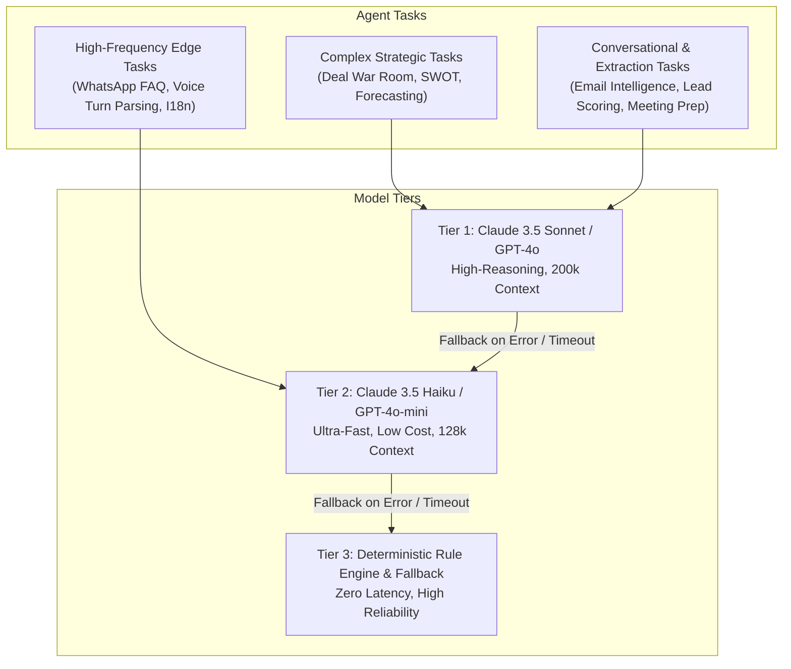
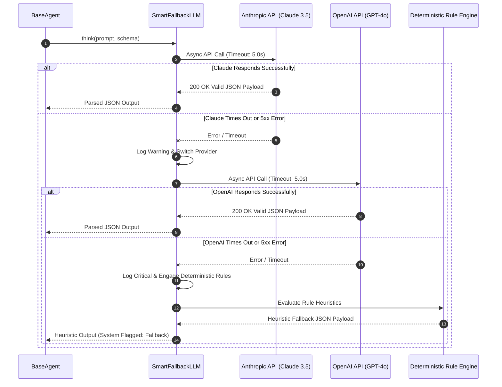

# 🧠 Model Requirement Document (MRD)
## Multi-Agent LLM Architecture, Model Specifications & Fallback Strategies

**Document Version**: 2.4.0  
**AI Architecture**: Cascading Multi-Provider LLM Fleet & Structured Output Engine  
**Core Framework**: `BaseAgent`, `TraceMixin`, `SmartFallbackLLM`, `AsyncAnthropic`, `AsyncOpenAI`

---

## 1. Model Ecosystem & Selection Strategy

The platform employs a **hybrid, multi-provider model topology** balancing reasoning depth, response latency, context window capacity, and API unit economics.



---

## 2. Model Specifications by Specialized Agent

| Specialized Agent | Primary Model Provider | Fallback Model Provider | Context Window | Target Latency (P95) | Output Schema Format |
| :--- | :--- | :--- | :--- | :--- | :--- |
| **Lead Qualification** | Claude 3.5 Sonnet | GPT-4o | 8k tokens | < 1,500ms | Structured JSON (BANT Score, Tier, Intent) |
| **Email Intelligence** | Claude 3.5 Sonnet | GPT-4o | 16k tokens | < 1,800ms | Structured JSON (Sentiment, Emotion, Draft) |
| **Sales Pipeline** | GPT-4o | Claude 3.5 Sonnet | 16k tokens | < 2,000ms | Structured JSON (Health, Velocity, Bottlenecks) |
| **Customer Success** | Claude 3.5 Sonnet | GPT-4o | 16k tokens | < 1,600ms | Structured JSON (Churn Risk, Playbook Action) |
| **Meeting Scheduler** | Claude 3.5 Haiku | GPT-4o-mini | 8k tokens | < 1,200ms | Structured JSON (Agenda, Briefing, Email Body) |
| **Voice AI Studio** | GPT-4o | Claude 3.5 Sonnet | 12k tokens | < 1,000ms | Structured JSON (Turn Intent, Battle-Card, Debrief) |
| **WhatsApp Business**| Claude 3.5 Haiku | GPT-4o-mini | 4k tokens | < 800ms | Plain Text & Parameter Template Substitution |
| **Deal War Room** | Claude 3.5 Sonnet | GPT-4o | 32k tokens | < 3,000ms | Structured JSON (SWOT, Consensus, Battle-Cards) |
| **Custom Agent Builder**| User-Configured | Claude 3.5 Sonnet | 16k tokens | Variable | Structured JSON & Free-form Markdown |

---

## 3. Hyperparameter Configuration Matrix

```mermaid
quadrantChart
    title Temperature vs Token Budget Distribution
    x-axis Low Creativity (0.0) --> High Creativity (1.0)
    y-axis Small Budget (500 tokens) --> Large Budget (4000 tokens)
    quadrant-1 Exploratory & Generative
    quadrant-2 Strategic & Analytical
    quadrant-3 High-Speed Deterministic
    quadrant-4 Creative Conversational
    Lead Qualification Agent: [0.10, 0.25]
    Analytics & Forecasting: [0.15, 0.75]
    Deal War Room Strategy: [0.20, 0.90]
    Email Intelligence: [0.35, 0.60]
    Voice AI Turn Analysis: [0.10, 0.30]
    Custom Step Copywriter: [0.55, 0.70]
    WhatsApp Auto-Pilot: [0.30, 0.35]
```

### 3.1 Role-Specific Hyperparameters

1. **Lead Qualification & Scoring**:
   - `temperature`: `0.1` (Minimizes score variance across repeated evaluations)
   - `top_p`: `0.9`
   - `max_tokens`: `800`
   - `frequency_penalty`: `0.0`
2. **Email Intelligence & Synthesis**:
   - `temperature`: `0.3` (Balances tone naturalness with strict schema fidelity)
   - `top_p`: `0.95`
   - `max_tokens`: `1500`
   - `frequency_penalty`: `0.1`
3. **Deal War Room Consensus & SWOT**:
   - `temperature`: `0.2` (Deep analytical reasoning)
   - `top_p`: `0.95`
   - `max_tokens`: `3000`
   - `frequency_penalty`: `0.0`
4. **Voice AI Turn & Battle-Cards**:
   - `temperature`: `0.1` (Ultra-low latency and factual counter-arguments)
   - `top_p`: `0.9`
   - `max_tokens`: `600`
   - `frequency_penalty`: `0.0`

---

## 4. Prompt Engineering Architecture & System Prompts

All system prompts follow a standardized four-tier meta-prompt structure:
1. **Identity & Authority**: Defines domain expertise and strict boundary rules.
2. **Context Injection**: Ingests dynamic CRM entity state (Deal value, historical emails, customer lifecycle stage).
3. **Structured Instruction**: Outlines step-by-step reasoning and algorithmic constraints.
4. **Output Schema Enforcement**: Mandates valid RFC-8259 JSON output wrapped without markdown wrappers or naked text.

### 4.1 Example Meta-Prompt: Lead Qualification Agent
```markdown
<SYSTEM_INSTRUCTION>
You are the Lead Qualification Intelligence Agent for an Enterprise CRM.
Your objective is to evaluate inbound prospect data using the BANT (Budget, Authority, Need, Timeline) framework.

RULES:
1. Calculate a BANT intent score between 0 and 100.
2. Assign a qualification tier: 'Tier 1' (score >= 80), 'Tier 2' (50 <= score < 80), 'Tier 3' (score < 50).
3. Extract explicit business pain points and urgency indicators.
4. You MUST reply ONLY with a valid JSON object matching the schema below. Zero preamble.

SCHEMA:
{
  "intent_score": integer,
  "tier": "Tier 1" | "Tier 2" | "Tier 3",
  "bant_breakdown": {
    "budget_score": integer,
    "authority_score": integer,
    "need_score": integer,
    "timeline_score": integer
  },
  "key_pain_points": [string],
  "recommended_action": string
}
</SYSTEM_INSTRUCTION>
```

---

## 5. Resilient Fallback Mechanics (`SmartFallbackLLM`)

The `SmartFallbackLLM` class wraps all downstream LLM calls in an asynchronous cascading execution loop:



---

## 6. Model Safety, Hallucination Mitigation & PII Protection

1. **Hallucination Mitigation**:
   - Strict JSON schema decoding with Pydantic model validation.
   - Temperature clamping ($\le 0.35$) across all operational analytical agents.
   - Grounded context injection (explicit database entity snapshots injected into prompts).
2. **PII Redaction & Token Masking**:
   - In-flight regex filters masking credit card numbers, Social Security Numbers (SSN), and confidential financial credentials prior to LLM submission.
3. **Prompt Injection Defense**:
   - Customer-supplied email bodies, WhatsApp messages, and voice transcripts are isolated inside `<USER_INPUT>` XML delimiters with explicit instructions to ignore prompt escape directives.
