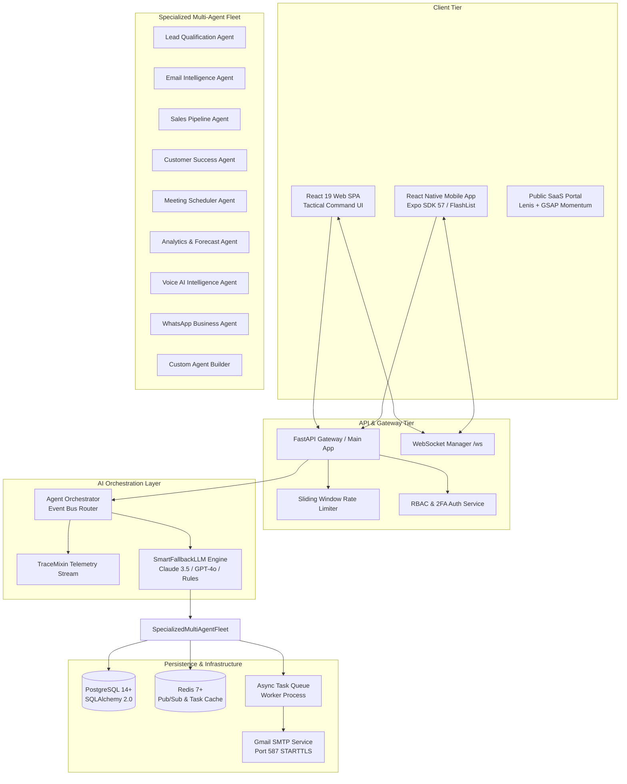

# 📋 Product Requirement Document (PRD)
## Multi-Agent Autonomous Enterprise CRM Platform

**Document Version**: 2.4.0  
**Status**: Approved & Baselined  
**Author**: Antigravity Product & AI Architecture Group  
**Target Systems**: Web SPA (React 19), Mobile App (Expo SDK 57), Backend Micro-Services (FastAPI, Redis, PostgreSQL)

---

## 1. Executive Summary & Vision

### 1.1 Problem Statement
Modern enterprise sales, customer success, and revenue operations teams suffer from acute fragmentation across disconnected communication channels (Email, WhatsApp, Voice calls), manual CRM data entry, delayed lead triage, and opaque forecasting models. Sales representatives spend upwards of 64% of their working hours on administrative overhead rather than direct customer engagement.

### 1.2 Product Vision
The **AI-Powered Multi-Agent CRM Platform** is an enterprise-grade, autonomous revenue acceleration operating system. It deploys an orchestrated fleet of specialized AI agents working 24/7 in real time to qualify inbound leads, parse multi-channel customer communications, predict churn hazards, automate SDR cadences, orchestrate complex deal war rooms, and generate ML-driven Monte Carlo revenue forecasts.

### 1.3 Target Personas
1. **Chief Revenue Officer (CRO) & VP of Sales**: Demands macro-level pipeline visibility, ARR forecasting accuracy with P10/P50/P90 confidence bounds, and multi-agent deal consensus.
2. **Account Executive (AE) / Field Sales Representative**: Requires instantaneous deal health diagnostics, automated competitor battle-cards, 1-click proposal generation, and field-ready mobile intelligence with offline sync.
3. **Sales Development Representative (SDR)**: Needs autonomous lead scoring (BANT framework), automated multi-touch outreach cadences across Email/WhatsApp/Voice, and dynamic objection-handling battle-cards.
4. **Customer Success Manager (CSM)**: Focuses on telemetry-driven customer lifecycle stages, early churn risk detection, and 1-click autonomous retention intervention playbooks.
5. **System Administrator & Security Auditor**: Requires granular Role-Based Access Control (RBAC), multi-factor authentication (2FA OTP), rate limiting, SSRF/formula injection defense, and immutable audit logs.

---

## 2. Product Objectives & Success Metrics (OKRs)

| Objective | Key Result (KR) | Target Baseline | Target Goal |
| :--- | :--- | :--- | :--- |
| **Accelerate Lead Velocity** | Inbound lead qualification and routing response latency | 4.2 hours | < 15 seconds |
| **Enhance Win Rates** | Win rate on deals managed through the Deal War Room | 22.4% | > 34.0% |
| **Mitigate Account Churn** | Churn rate in early adoption and renewal stages | 14.2% ARR | < 4.5% ARR |
| **Rep Productivity Lift** | Hours spent per rep per week on manual CRM entry & follow-ups | 18.5 hrs/wk | < 3.2 hrs/wk |
| **Forecast Accuracy** | Variance between forecasted ARR and quarterly closed ARR | ± 28% | ± 4.2% (P50 confidence) |
| **Field Mobile Adoption** | Daily Active Users (DAU) on mobile with offline sync & voice debrief | 12% | > 85% |

---

## 3. High-Level System Architecture & Agent Ecosystem

---

## 4. Feature Requirements Breakdown

### 4.1 Enterprise Security, Authentication & User Management
* **Multi-Step 2FA Registration**: Automated 6-digit OTP delivery via Gmail SMTP (`send_otp_email`), SHA-256 hashed DB persistence (`OtpToken`), 2-minute countdown timer, rate-limited resend, and session activation.
* **Role-Based Access Control (RBAC)**: Fine-grained permission matrices for `admin`, `sales`, `support`, and `auditor` with client-side `PermissionGuard` and backend `require_permission` decorators.
* **User Management Studio**: Centralized user CRUD with status filters (`active`, `inactive`, `locked`), role assignment, individual permission override, password reset, and brute-force lockout recovery.
* **Audit Trail**: Append-only immutable log capturing all entity mutations, authentication attempts, and automated agent actions with IP and User-Agent telemetry.

### 4.2 Multi-Agent Core Capabilities
* **Lead Qualification Agent**: BANT (Budget, Authority, Need, Timeline) score calculation, intent rating (0–100), automated tier assignment (`Tier 1`, `Tier 2`, `Tier 3`), and automated high-value lead email dispatching.
* **Email Intelligence Agent**: Sentiment classification (`positive`, `neutral`, `negative`), emotion extraction, context-aware auto-draft synthesis, and direct outbound delivery delegation to `services/email_service.py`.
* **Sales Pipeline Agent**: Real-time deal health scoring, velocity anomaly detection, bottleneck diagnostics, and automated stage follow-up cadence scheduling.
* **Customer Success Agent**: Churn probability calculation, customer health scoring, ARR exposure aggregation, and automated retention playbooks (`executive_check_in`, `usage_audit`, `training_workshop`, `discount_retention`).
* **Meeting Scheduler Agent**: Stakeholder background synthesis, meeting agenda generation, executive briefing preparation, and automated Google Meet calendar invitation dispatching.
* **Voice AI Call Intelligence Agent**: Live speech turn transcription parsing, real-time objection battle-card triggers, intent extraction, and post-call CRM synthesis with audio debrief synthesis.
* **WhatsApp Business Agent**: 24/7 AI Auto-Pilot conversation triage, broadcast template marketing campaigns, inbound webhook simulator, and contact tagging.
* **Custom Agent Builder**: No-code visual agent creator with dynamic prompt interpolation, trigger conditions, and custom tool bindings.

### 4.3 Deal War Room & Strategy Studio
* **Multi-Agent Consensus Verdict**: Aggregate deal win probability calculated from multi-agent scoring perspectives (Sales, CS, Voice, Lead).
* **Live SWOT Matrix**: Dynamic analysis of deal Strengths, Weaknesses, Opportunities, and Threats based on CRM history.
* **Competitor Battle-Cards**: Counter-tactics, differentiation talking points, and 1-click clipboard battle-cards.
* **1-Click Smart Proposal Studio**: Multi-tier pricing calculation (`Starter`, `Growth`, `Enterprise`), custom discount validation, SLA term selection, e-signature URL generation, and direct buying committee dispatch.

### 4.4 Customer Journey & Churn Prevention Studio
* **5-Stage Lifecycle Pipeline**: Visual tracking across `onboarding`, `adoption`, `expansion`, `renewal`, and `at_risk`.
* **Arr & Health Aggregation**: Dynamic metrics computing total active accounts, portfolio ARR, and at-risk revenue per stage.
* **Intervention Lifecycle**: Automated play triggering and resolution tracking via `POST /api/journey/interventions/{id}/resolve`.

### 4.5 AI SDR Multi-Touch Outreach Sequences
* **Omnichannel Cadence Builder**: Multi-step outreach spanning Email, WhatsApp, and Voice AI phone briefings with configurable day offsets.
* **Dynamic Cohort Enrollment**: Filter and enroll CRM leads and contacts directly into active sequences.
* **AI Step Copy Generation**: Context-aware step copywriting tailored to prospect industry and company profile.

### 4.6 Monte Carlo Revenue Forecasting Studio
* **Stochastic Simulation Engine**: 1,000+ iteration Monte Carlo simulation computing P10 (conservative), P50 (expected), and P90 (optimistic) ARR projections.
* **Stage Velocity Hazard Matrix**: Stage-by-stage duration in days, conversion probabilities, and drop-off risks.
* **Scenario Management**: Persistent simulation scenario comparison and delta analysis.

### 4.7 Field Sales Mobile Suite (Expo SDK 57)
* **78 Static Route File-Based Navigation**: High-speed navigation covering Deals, Leads, Customers, Meetings, Voice Studio, Workflows, and Settings.
* **List Virtualization (`@shopify/flash-list`)**: Memory-recycled list rendering with 60–120 FPS performance.
* **Universal Voice Playback Studio**: Cross-platform speech synthesis bridging Web Speech API and Expo Speech.
* **Offline Sync Queue**: Dual-layer memory + AsyncStorage queue with automatic 30s background retry sync.
* **Dynamic Custom Fields**: Dynamic form evaluation supporting `text`, `number`, `select`, `boolean`, `date`, and `currency`.

---

## 5. Non-Functional Requirements (NFRs)

| Category | Requirement | Standard / Benchmark |
| :--- | :--- | :--- |
| **Performance** | API Response Latency (P95) | < 120ms (read), < 350ms (write) |
| **Performance** | WebSocket Broadcast Latency | < 50ms from event publication |
| **Scalability** | Concurrent Active Sessions | > 10,000 concurrent web/mobile clients |
| **Availability** | System Uptime SLA | 99.95% availability excluding scheduled maintenance |
| **Security** | Transport Encryption | TLS 1.3 forced on all endpoints; HSTS 1-year preload |
| **Security** | Payload Sanitization | Zero XSS, zero SQLi, zero CSV formula injection (`=`, `+`, `-`, `@`) |
| **Security** | SSRF Defense | Private IP & cloud metadata range blocking on webhook URLs |
| **Accessibility** | Tactical Command UI Theme | WCAG 2.1 AA compliant contrast ratios across dark/light themes |

---

## 6. Release Phases & Milestones

1. **Phase 1 (Core Foundation & Security - M1)**: JWT/2FA Auth, RBAC, Database schema, REST APIs, BaseAgent framework, Tactical Command web UI.
2. **Phase 2 (Specialized Multi-Agent Suite - M2)**: Lead Qualification, Email Intelligence, Sales Pipeline, Customer Success, Meeting Scheduler, and Voice Call agents.
3. **Phase 3 (Strategic Acceleration & SDR - M3)**: Deal War Room, Proposal Studio, Churn Prevention, Multi-Touch Sequences, and WhatsApp Hub.
4. **Phase 4 (Mobile Field Sales & Forecasting - M4)**: Expo SDK 57 mobile app, FlashList virtualization, Universal Voice Playback, and Monte Carlo ML Forecasting.
5. **Phase 5 (Enterprise Hardening & Scale - M5)**: Persistent async task queues, rate limiting, audit logging, security headers, and full test suite verification.
