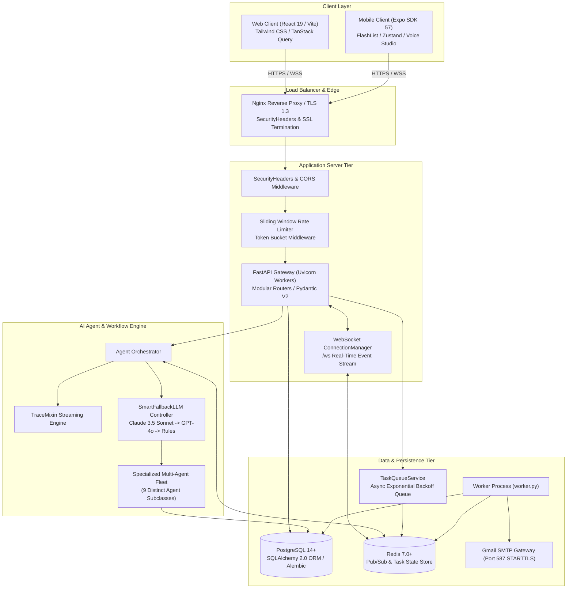
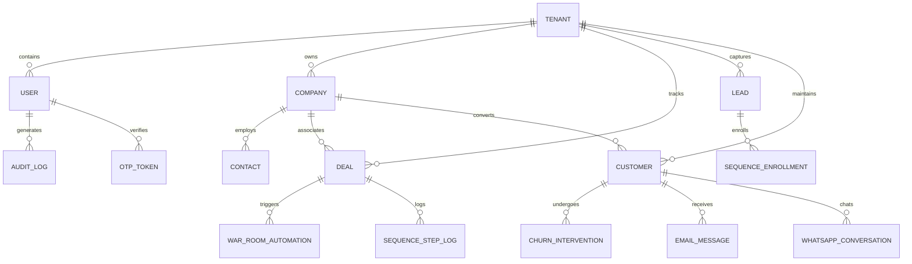
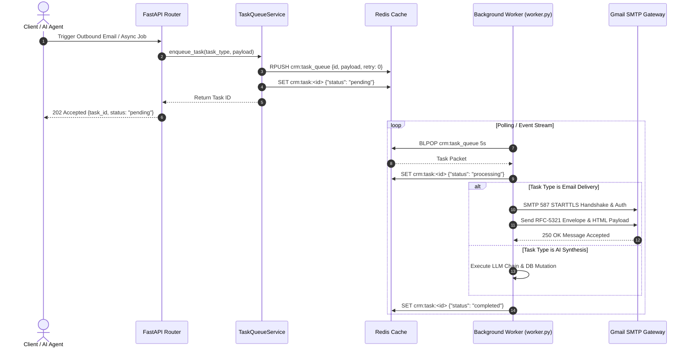

# ⚙️ Technical Requirement Document (TRD)
## Multi-Agent Autonomous Enterprise CRM Architecture & Specifications

**Document Version**: 2.4.0  
**Target Architecture**: Micro-Services & Distributed Multi-Agent Bus  
**Runtime**: Python 3.9+ (FastAPI), React 19 (TypeScript/Vite), Expo SDK 57 (React Native 0.86), PostgreSQL 14+, Redis 7+

---

## 1. System Architecture & Topology

---

## 2. Technology Stack & Component Specifications

### 2.1 Backend Core
* **Framework**: FastAPI (Async ASGI framework powered by Starlette & Uvicorn).
* **Validation & Schemas**: Pydantic V2 (`BaseModel`, `Field`, `validator`, `model_validator`, `Annotated`).
* **Database ORM**: SQLAlchemy 2.0 with `asyncpg` / `psycopg2-binary` engine drivers and Declarative Base with UUID primary keys.
* **Schema Migrations**: Alembic 1.12+ versioned migration chain.
* **Logging & Telemetry**: Loguru structured JSON logging and `TraceMixin` real-time telemetry streaming.

### 2.2 AI & Multi-Agent Layer
* **Agent Framework**: Custom event-driven multi-agent framework extending `BaseAgent` (`agents/base_agent.py`).
* **LLM Clients**: `AsyncAnthropic` (Claude 3.5 Sonnet) and `AsyncOpenAI` (GPT-4o) with async streaming and structured JSON output parsing.
* **Resilience Layer**: `SmartFallbackLLM` providing automated fallback cascading:
  $$\text{Primary (Anthropic)} \xrightarrow{\text{on error/timeout}} \text{Secondary (OpenAI)} \xrightarrow{\text{on error/timeout}} \text{Deterministic Rule Engine}$$
* **Telemetry Streaming**: Real-time websocket event emission of agent thought states (`think`, `tool_call`, `status`, `complete`).

### 2.3 Frontend & Web Framework
* **Core Engine**: React 19 SPA with TypeScript 5.5 and Vite 5.x.
* **Server State**: TanStack React Query v5 with query key factories, optimistic mutations, and automated cache invalidation.
* **Client State**: Zustand stores (`useUIStore`, `useAuthStore`, `useNotificationStore`).
* **Design & Styling**: Tailwind CSS 3.4 with Tactical Command Design Tokens (`#0B0C10` Void Black, `#121212` Matte Black, `#3A4552` Steel, `#FFB800` Tactical Gold, `#00FF9D` Emerald, `#FF2A54` Red, sharp zero-radius geometry, monospace data displays).
* **Momentum Scroll & Animation**: Lenis smooth scrolling synchronized with GSAP `ScrollTrigger` tickers.

### 2.4 Field Sales Mobile Framework
* **Runtime**: React Native 0.86 with Expo SDK 57.
* **Routing**: Expo Router v3 (file-based navigation across 78 static routes).
* **List Virtualization**: `@shopify/flash-list` recycling memory cells for 60–120 FPS render performance.
* **Speech Playback**: Platform-split `VoicePlaybackService` (`voicePlaybackService.web.ts` using Web Speech API; `voicePlaybackService.native.ts` dynamically bridging `expo-speech`).
* **Offline Engine**: Two-tier memory cache + `AsyncStorage` write queue with 30s background retry loop.

---

## 3. Database Schema & Data Models

All models inherit from `database/models.py:Base` using UUIDv4 primary keys.

### 3.1 Primary Entities Specification
1. **User (`users`)**:
   - `id: UUID (PK)`
   - `email: String(255) (Unique, Indexed)`
   - `hashed_password: String(255)`
   - `role: Enum('admin', 'sales', 'support', 'auditor')`
   - `permissions: JSONB (Custom permission overrides)`
   - `is_active: Boolean`, `is_locked: Boolean`, `two_factor_enabled: Boolean`
   - `created_at: DateTime(UTC)`, `updated_at: DateTime(UTC)`
2. **OtpToken (`otp_tokens`)**:
   - `id: UUID (PK)`
   - `user_id: UUID (FK -> users.id, Cascade)`
   - `token_hash: String(64) (SHA-256 hash of 6-digit OTP)`
   - `purpose: String(50) ('registration_2fa', 'password_reset')`
   - `expires_at: DateTime(UTC) (2-minute window)`
   - `is_used: Boolean`
3. **Deal (`deals`)**:
   - `id: UUID (PK)`
   - `title: String(255)`, `company_id: UUID (FK)`
   - `value: Numeric(12,2)`, `stage: Enum('discovery', 'proposal', 'negotiation', 'won', 'lost')`
   - `win_probability: Float (0.00 to 1.00)`
   - `health_score: Integer (0 to 100)`
   - `custom_fields: JSONB`
4. **Lead (`leads`)**:
   - `id: UUID (PK)`
   - `first_name: String`, `last_name: String`, `email: String (Indexed)`
   - `bant_budget: Float`, `bant_authority: String`, `bant_need: String`, `bant_timeline: String`
   - `intent_score: Integer (0 to 100)`, `tier: Enum('Tier 1', 'Tier 2', 'Tier 3')`
5. **Customer (`customers`)**:
   - `id: UUID (PK)`
   - `company_name: String`, `arr: Numeric(12,2)`
   - `lifecycle_stage: Enum('onboarding', 'adoption', 'expansion', 'renewal', 'at_risk')`
   - `health_score: Integer (0 to 100)`, `churn_probability: Float (0.00 to 1.00)`
6. **TaskQueueEntry (`crm_tasks`)**:
   - `id: UUID (PK)`
   - `task_type: String(50) ('email_delivery', 'ai_synthesis', 'batch_sequence')`
   - `payload: JSONB`, `status: Enum('pending', 'processing', 'completed', 'failed')`
   - `retry_count: Integer`, `max_retries: Integer (Default 3)`
   - `error_message: Text`, `scheduled_at: DateTime`, `completed_at: DateTime`

---

## 4. REST API Endpoint Specifications

The FastAPI application exposes 16 modular routers mounted under `/api`:

| Domain Router | Base Path | Key Methods & Routes | Primary Function |
| :--- | :--- | :--- | :--- |
| **Auth & RBAC** | `/api/auth` | `POST /register`, `POST /login`, `POST /verify-otp`, `POST /resend-otp`, `POST /forgot-password`, `GET /me` | Token rotation, 2FA validation, password recovery |
| **Leads** | `/api/leads` | `GET /`, `POST /`, `GET /{id}`, `PUT /{id}`, `POST /{id}/qualify` | BANT scoring, tiering, agent qualification |
| **Deals** | `/api/deals` | `GET /`, `POST /`, `GET /{id}`, `PUT /{id}`, `POST /{id}/analyze` | Pipeline stages, health diagnostics |
| **Customers** | `/api/customers` | `GET /`, `POST /`, `GET /{id}`, `PUT /{id}`, `GET /{id}/health` | Customer 360, churn risk analysis |
| **Emails** | `/api/emails` | `GET /`, `POST /send`, `POST /{id}/reply`, `POST /{id}/analyze` | Sentiment analysis, draft generation, queue dispatch |
| **Meetings** | `/api/meetings` | `GET /`, `POST /`, `POST /{id}/prep`, `POST /{id}/invite` | AI meeting prep briefs, calendar invitations |
| **Voice AI** | `/api/voice-calls`| `POST /analyze-turn`, `POST /synthesize-call`, `POST /debrief` | Live transcript analysis, objection battle-cards |
| **WhatsApp** | `/api/whatsapp` | `GET /conversations`, `POST /messages`, `POST /webhook`, `POST /broadcast` | 24/7 AI chat, template broadcasts |
| **War Room** | `/api/war-room` | `GET /{deal_id}/strategy`, `POST /{deal_id}/proposals`, `POST /automations` | Consensus scoring, SWOT, proposal generation |
| **Journey** | `/api/journey` | `GET /pipeline`, `POST /interventions`, `POST /interventions/{id}/resolve`| 5-stage lifecycle, autonomous retention plays |
| **Sequences** | `/api/sequences`| `GET /`, `POST /`, `POST /{id}/enroll`, `POST /{id}/execute-step` | Multi-touch outreach execution |
| **Forecasting** | `/api/forecasting`| `POST /simulate`, `GET /scenarios`, `GET /matrix` | Monte Carlo ARR simulations, stage velocity |
| **Custom Agents**| `/api/custom-agents`| `GET /`, `POST /`, `POST /{id}/execute` | Visual agent builder & execution playground |
| **I18n** | `/api/i18n` | `GET /translations/{lang}`, `POST /translate-missing`, `POST /preferences`| Dynamic localization & layout direction |
| **Tasks** | `/api/tasks` | `GET /`, `GET /{id}/status`, `POST /{id}/retry` | Background task monitoring & retry controls |
| **Audit Logs** | `/api/audit-logs`| `GET /`, `GET /stats`, `GET /export` | Entity mutation logs, compliance reporting |

---

## 5. Asynchronous Task Queue & Email Infrastructure

### Exponential Backoff Retry Formula
When a transient network or SMTP failure occurs, the task worker applies exponential backoff:
$$T_{\text{wait}} = \text{base\_delay} \times 2^{\text{retry\_count}} \quad (\text{where } \text{base\_delay} = 1.0\text{s}, \, \text{max\_retries} = 3)$$

---

## 6. Cybersecurity, Transport & Hardening Specifications

1. **Security Headers Middleware**:
   - `X-Content-Type-Options: nosniff`
   - `X-Frame-Options: DENY`
   - `X-XSS-Protection: 1; mode=block`
   - `Referrer-Policy: strict-origin-when-cross-origin`
   - `Strict-Transport-Security: max-age=31536000; includeSubDomains; preload`
   - `Content-Security-Policy: default-src 'self'; connect-src 'self' wss: https:; img-src 'self' data: https:; style-src 'self' 'unsafe-inline'; font-src 'self' data:;`
2. **Formula Injection Defense**:
   All dynamic CSV export cells are sanitized via `services/audit_service.py:sanitize_csv_cell`:
   $$\text{If } \text{cell}[0] \in \{ '=', '+', '-', '@', '\backslash t', '\backslash r' \} \implies \text{Prepend } '$$
3. **SSRF Webhook Validation**:
   Outbound webhook URLs are parsed and checked against private/reserved IP blocks (`10.0.0.0/8`, `172.16.0.0/12`, `192.168.0.0/16`, `127.0.0.0/8`, `169.254.169.254`).
4. **Rate Limiting Engine**:
   Sliding window token bucket restricting endpoints to 100 requests/minute per client IP, returning standard RFC headers (`X-RateLimit-Limit`, `X-RateLimit-Remaining`, `X-RateLimit-Reset`).
